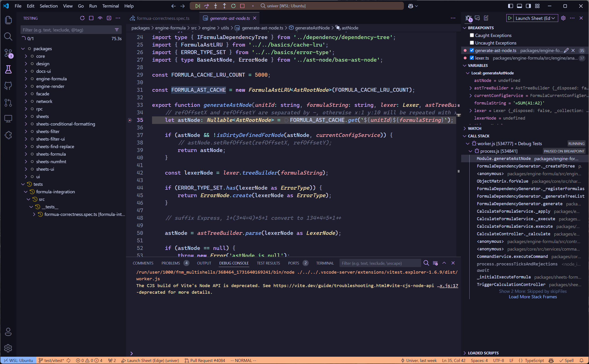

<!-- https://univer.ai/guides/sheet/contributing/ -->

# Univer Contributing Guide

Welcome, and thank you for your interest in contributing to Univer!

Please read our [Code of Conduct](./CODE_OF_CONDUCT.md) before you join in the Univer community.

## Asking Questions

If you encounter any issues while using Univer, you can seek help in the following communities:

- [Discord community](https://discord.gg/z3NKNT6D2f)
- [GitHub Discussions](https://github.com/dream-num/univer/discussions)
- Join the Univer Chinese community (please scan the QR code [here](https://univer.ai/contact))

## Reporting Issues

If you encounter any issues or have any suggestions while using Univer, please feel free to raise them in the Github Issues. We will respond promptly.

To better assist you, we recommend:

- Before submitting an issue, please search to see if someone has already raised a similar question.
- We provide an [issue template](https://github.com/dream-num/univer/issues/new/choose) and encourage you to fill it out with sufficient information, which helps us quickly identify the problem.
- Please try to describe the issue in English, as it enables more people to participate in the discussion. We will also make an effort to reply in English to benefit a wider audience.

> If you're new to submitting issues, we recommend to read [How To Ask Questions The Smart Way](http://www.catb.org/~esr/faqs/smart-questions.html) and [How to Report Bugs Effectively](https://www.chiark.greenend.org.uk/~sgtatham/bugs.html) before posting. Well-written bug reports help us and help you!

## Contributing Code

### Install dependencies

The development of Univer requires Node.js >= 22.18 and pnpm >= 11. Please make sure you have the correct versions installed.

```shell
git clone https://github.com/dream-num/univer
cd univer

# install package manager pnpm
npm i -g pnpm

# install dependencies
pnpm install
```

### Start dev server

```shell
pnpm dev
```

### Architecture

Please refer to [Architecture](https://docs.univer.ai/guides/recipes/architecture/univer), and also [ISOMORPHIC.md](./docs/ISOMORPHIC.md) for more guidance on how to set up plugins.

For public API compatibility expectations, experimental APIs, internal APIs, and deprecation rules, read [API_STABILITY.md](./docs/API_STABILITY.md).

### Source code organization

The structure of the repository is as follows:

```txt
.
├── common/ shared configuration and utilities
├── docs/ documentation
├── examples/ all-in-one Vite workbench for browser development
├── packages/ Univer core and plugins
```

The file structure of a plugin should be organized as follows:

```txt
|- common/
|- models/
|- services/
|- commands/
  |- commands/
  |- mutations/
  |- operations/
|- controllers/
|- views/
  |- components/
  |- parts/
|- plugin.ts
|- index.ts
```

There are some limits on what paths could a file import from.

- common cannot import file in other folders
- models can only import files from common
- services can only import files from models and common
- commands can only import files from common, models and services

During the refactoring process, it is recommended to remove legacy folders such as `Enum`, `Interface`, `Basics`, and `Shared`.

Avoid creating barrel imports (index.ts) unless it is the main root index.ts file of a plugin.

#### Desktop & Mobile

We added experimental support for mobile platforms since June 2024. After that, all UI plugins should split ui related code by their running platforms:

```txt
|- controllers/
  |- render-controllers/
    |- common/
    |- desktop/
    |- mobile/
|- views/
  |- components/
    |- common/
    |- desktop/
    |- mobile/
  |- parts/
    |- common/
    |- desktop/
    |- mobile/
```

### Connecting context

To effectively contribute as a member of a software engineering team (and community as well!), it is crucial to establish strong contextual connections. Providing links to relevant resources can greatly assist others in understanding the context. Consider the following practices:

- Include the link to the corresponding issue in your commit message.
- Leave comments with links to the relevant context within the code.
- Whenever possible, document important information directly within the codebase itself.

By adopting these practices, you can enhance collaboration and facilitate a better understanding of the codebase within our community.

### Naming convention

Please refer to [Univer Naming Convention](./docs/NAMING_CONVENTION.md).

### Submitting pull requests

Before merging a pull request, please make sure the following requirements are met:

- All tests are passed. ESLint and Prettier errors are fixed.
- Test coverage is not decreased.

We provide preview deployments for pull requests. You can view the preview deployment by clicking the "Preview" link in the "View Deployment" section.

### Storybook

We use Storybook to develop and test components in isolation. It is a great tool to develop UI components in isolation, which can improve component reuse, testability, and development efficiency. You can use the following command to start Storybook:

```shell
pnpm storybook:dev
```

When a new pull request is submitted, a Storybook deployment will be automatically generated. You can view the Storybook deployment by clicking the "Preview" link in the "View Storybook" section.

### Debugging

We provided some Visual Studio Code (vscode) tasks to help you debug in vscode.

After stating dev server, you can launch Edge or Chrome instance and debug in vscode, and you can debug directly in vscode!


### Unit test

To ensure the quality of the code and move with confidence, we require that all code must be covered by unit tests. We use vitest as the unit test framework. You can use the following command to run unit tests:

```shell
pnpm test
```

Also, with the help of vscode and its rich ecosystem, you could directly debug unit tests in vscode. Please install the extension we recommend, and you will see the debug button in the side bar. In addition, if you add a new plugin, you should update `vitest.workspace.js` to include the new plugin.



### Browser workbench

`pnpm dev` starts one Vite workbench with lazy-loaded Sheets, Docs, and Slides routes. Use the navigation bar or `#sheets`, `#docs`, and `#slides` URLs to switch products; only one Univer instance stays mounted. The Settings menu provides every built-in language, LTR/RTL direction, region, theme, appearance, ribbon, UI chrome, and zoom controls. Preferences are stored in localStorage and applied to the active instance through runtime APIs without remounting it. Development locale data is loaded on demand so unused product and language graphs do not remain in Vite's memory. End-to-end suites should consume built packages outside this repository instead of coupling tests to source examples.

### Build Preview

After building, the output may differ from the source code. To test for any differences, you can link to the built artifacts using:

```shell
pnpm build
pnpm dev:libs
```

### Clean code

> Programs are meant to be ready by humans and only incidentally for computers to execute. - Harold Abelson

- Do not expose properties or methods those are not necessary to be exposed.
- Group related methods or properties together. Do not always use blank lines to separate them.
- Keep your concepts consistent by naming your variables consistently.

References:

- [Make your code readable](https://www.notonlycode.org/make-your-code-readable/)

### New Package

Create a new package with our CLI tool:

```shell
# pnpm
pnpm create @univerjs/cli init <project-name>

# npm
npm create @univerjs/cli init <project-name>
```

### How to Contribute to Facade API

Please refer to [How to Contribute to Facade API](./docs/CONTRIBUTING-FACADE.md).

### Deprecate API

If you are going to deprecate an API, follow the [API Stability Policy](./docs/API_STABILITY.md) and the steps below:

1. Mark the API as deprecated in the JSDoc, and use `{@link}` to refer to the new API.
2. In the implementation, call `deprecate` of `ILogService` to log a deprecation message.
3. Document the migration path in the relevant guide, README, changelog, or release notes when the API is broadly used.
4. Deprecated stable APIs should remain available until the next major release unless the API is unsafe, broken, or impossible to preserve. In pre-1.0 releases, removals may happen in a minor release, but they should be documented as breaking changes.
