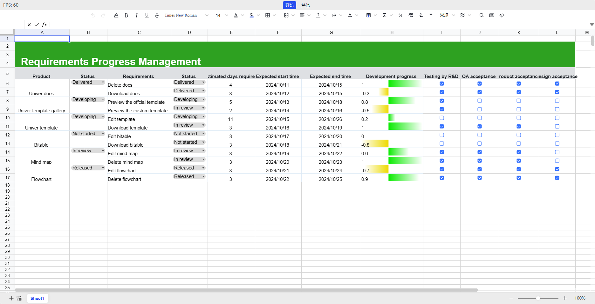

    <picture>
        <source media="(prefers-color-scheme: dark)" srcset="./docs/img/banner-light.png">
        
    </picture>

    
    
    
    
    

    <a href="./README.md">English</a>
    |
    <a href="./README-zh.md">简体中文</a>
    |
    日本語

<!-- An introduction photo here. -->

> 🚧 このプロジェクトはまだ開発中です。API が大きく変更される可能性があることにご注意ください。問題や提案をお寄せください。

## はじめに

Univer は、スプレッドシート、ドキュメント、スライドを含む、企業向けドキュメントおよびデータコラボレーションソリューションのセットです。拡張性の高い設計により、開発者は Univer をベースにカスタマイズされた機能を利用することができます。

Univer の機能のハイライト:

- 📈 Univer はスプレッドシートに対応しています。今後は文書やスライドにも対応する予定です。
- 🌌 拡張性の高いアーキテクチャ設計。
  - 🔌 プラグインアーキテクチャにより、ドキュメントの機能をオンデマンドで組み合わせることができ、サードパーティのプラグインをサポートし、カスタマイズ開発を容易にします。
  - 💄 開発者が一貫したユーザー体験を提供できるよう、コンポーネント・ライブラリとアイコンを提供する。
- ⚡ ハイパフォーマンス。
  - ✏️ Canvas をベースとした、統一された効率的なレンダリングエンジンと数式エンジン。
  - 🧮 ハイパフォーマンスフォーミュラエンジン、Web Worker をサポート。
- 🌍 国際化サポート。

## Examples

| <h3>📊 Univer Sheets</h3>                    |                   |
|:---------------------------------------|--------------------------------|
| [Sheets](https://www.univer.ai/examples/sheets/) Opened: cell styles, formulas. First quarter: conditional formatting, data validation, search and replace. Second quarter (tentative): floating pictures, filtering, sorting, annotations, charts, pivot tables, super tables (tables), shapes                |                            |
| [Sheets Multi](https://www.univer.ai/examples/sheets-multi/) Multiple Univer instances can be created on a page to allow interoperability between tables    |                            |
| [Sheets Uniscript](https://www.univer.ai/examples/sheets-uniscript/) In Univer Sheets, you can directly use JavaScript syntax to operate the data in the table to achieve automation. |                        |
| [Sheets Big Data](https://www.univer.ai/examples/sheets-big-data/) Loading 10 million cells of data, completed within 500ms |                        |
| [Sheets Collaboration](https://univer.ai/pro-examples/sheets-collaboration/) Please open two windows or invite friends to experience Univer Sheets collaboration together            |                            |
| [Sheets Collaboration Playground](https://univer.ai/pro-examples/sheets-collaboration-playground/) Demonstrate the process of collaboration. After A edits the form, how does B process it? Here is an interesting experiment  |                            |
| [Sheets Import/Export](https://univer.ai/pro-examples/sheets-exchange/) Supports xlsx file import and export                |                            |
| [Sheets Print](https://univer.ai/pro-examples/sheets-print/) Experience the HD printing capabilities of Univer Sheets                     |                            |
| [Sheets Data Validation / Conditional Formatting](https://univer-qqqkeqnw5-univer.vercel.app/sheets/) Development preview of Univer Sheets data formats and conditional formatting                     |                            |
| <h3>📝 Univer Docs</h3>                    |                   |
| [Docs](https://www.univer.ai/examples/docs/) Already open: ordered and unordered lists, paragraph settings, mixed graphics and text, multi-column/single column display in sections (tentative): hyperlinks, comments, tables, charts                                  |                            |
| [Docs Multi](https://www.univer.ai/examples/docs-multi/) Multiple Univer instances can be created in a page so that doc can interoperate. |                           |
| [Docs Uniscript](https://www.univer.ai/examples/docs-uniscript/) You can directly use JavaScript syntax to manipulate content in Univer Docs |                           |
| [Docs Big Data](https://www.univer.ai/examples/docs-big-data/) 1 million word Docs loading demo |                           |
| [Docs Collaboration](https://univer.ai/pro-examples/docs-collaboration/) Please open two windows or invite friends to experience Univer Docs collaboration together               |                            |
| [Docs Collaboration Playground](https://univer.ai/pro-examples/docs-collaboration-playground/) Demonstrate the process of collaboration. After A edits the document, how does B process it? Here is an interesting experiment    |     |
| <h3>🎨 Univer Slides</h3>                    |                   |
| [Slides](https://www.univer.ai/examples/slides/) A canvas presentation containing graphic text, floating pictures, tables and other elements                                  |                            |
| <h3>🧩 Univer Innovation</h3>                    |                   |
| [Zen Mode](https://univer.ai/guides/tutorials/zen-editor/#live-demo) The cell of Sheet is a Doc?                                 |                            |
| [Univer(SaaS version)](https://univer.ai/) With Univer, we enable users to create 3 forms of page as they wish. By merging sheet, doc and slide's capabilities together, Univer empowers individuals and teams to create, organize and streamline workflows effortlessly.                                   |                            |

## 使用方法

Univer を npm パッケージとしてインポートすることをお勧めします。ドキュメントサイトの [Quick Start](https://univer.ai/ja-jp/guides/quick-start/) セクションをご覧ください。また、[オンラインプレイグラウンド](https://univer.ai/playground/)では、開発環境を構築することなく Univer をプレビューすることができます。

ユニバーはプラグインアーキテクチャを採用しています。以下のパッケージをインストールすることで、Univer の機能を拡張することができます。

### パッケージ

| 名称                                                       | 説明                                                                                                                      | バージョン                                                                                                                     |
| :-------------------------------------------------------- | :------------------------------------------------------------------------------------------------------------------------ | :-------------------------------------------------------------------------------------------------------------------------- |
| [core](./packages/core)                                   | Univer のプラグインシステムとアーキテクチャを実装します。また、基本的なサービスや様々な種類のドキュメントのモデルを提供します。               |                      |
| [design](./packages/design)                               | Univer のデザインシステムを実装。CSS と React ベースのコンポーネントキットを提供します。                                              |                  |
| [docs](./packages/docs)                                   | リッチテキスト編集機能の基本ロジックを実装し、また他の種類の文書でのテキスト編集を容易になります。                                        |                      |
| [docs-ui](./packages/docs-ui)                             | Univer ドキュメントのユーザーインターフェースを提供します。                                                                       |                |
| [engine-formula](./packages/engine-formula)               | Canvas をベースとしたレンダリングエンジンを実装し、拡張可能です。                                                                  |  |
| [engine-numfmt](./packages/engine-numfmt)                 | ナンバーフォーマットエンジンを実装します。                                                                                      |    |
| [engine-render](./packages/engine-render)                 | canvas context2d をベースにしたレンダリングエンジンを実装します。                                                                |    |
| [facade](./packages/facade/)                              | Univer をより簡単に使用するための API レイヤーとして機能します。                                                                  |                        |
| [find-replace](./packages/find-replace)                   | Univer の検索と置換機能を実装しています。                                                                                      |                |
| [network](./packages/network)                             | WebSocket と HTTP をベースにしたネットワークサービスを実装します。                                                                |                |
| [rpc](./packages/rpc)                                     | Univer 文書の異なるレプリカ間でデータを同期するための RPC メカニズムとメソッドを実装します。                                            |                        |
| [sheets](./packages/sheets)                               | スプレッドシート機能の基本ロジック。                                                                                            |                  |
| [sheets-conditional-formatting](./packages/sheets-conditional-formatting)   | スプレッドシートの条件付き書式設定機能を実装します。                                                          |  |
| [sheets-find-replace](./packages/sheets-find-replace)     | スプレッドシートの検索と置換機能を実装しています。                                                                             |  |
| [sheets-formula](./packages/sheets-formula)               | スプレッドシートに数式を実装します。                                                                                           |  |
| [sheets-numfmt](./packages/sheets-numfmt)                 | スプレッドシートの数値フォーマットを実装します。                                                                                     |    |
| [sheets-zen-editor](./packages/sheets-zen-editor)         | スプレッドシートの禅編集モードを実装します。                                                                                   |    |
| [sheets-ui](./packages/sheets-ui)                         | Univer スプレッドシートのユーザーインターフェースを提供します。                                                                      |            |
| [ui](./packages/ui)                                       | React をベースにした Univer とワークベンチのレイアウトで、基本的なユーザーインタラクションを実装します。                                 |                          |
| [uniscript](./packages/uniscript) (試験的)                 | Typescript に基づく DSL を実装し、より高度なタスクの実行を可能にします。                                                      |            |

## コントリビュート

どのようなコントリビュートでも結構です。[問題や機能に関するリクエスト](https://github.com/dream-num/univer/issues)をお寄せください。まずは[コントビューティングガイド](./CONTRIBUTING.md)をお読みください。

Univer にコードをコントリビュートしたい方は、コントリビュートガイドもご参照ください。開発環境のセットアップからプルリクエストの提出までの手順を説明しています。

## サポート

Univer プロジェクトの成長と開発は、バッカーやスポンサーのサポートに依存しています。プロジェクトをサポートしていただける方は、スポンサーになることを検討していただければ幸いです。[Open Collective](https://opencollective.com/univer) からスポンサーになることができます。

スポンサーの皆様、ありがとうございます。スペースの制限のため、一部のスポンサーのみをここに掲載しています。ランキングは特にありません。

## Stargazers

## リンク

- [ドキュメント](https://univer.ai/ja-jp/guides/introduction/)
- [Online Playground](https://univer.ai/playground/)
- [公式 Website](https://univer.ai)

### コミュニティ

- [Discord コミュニティ](https://discord.gg/z3NKNT6D2f)

## ライセンス

Univer は Apache-2.0 ライセンスの下で配布されています。

---

Copyright © 2019-2024 Shanghai DreamNum Technology Co., Ltd. All rights reserved
