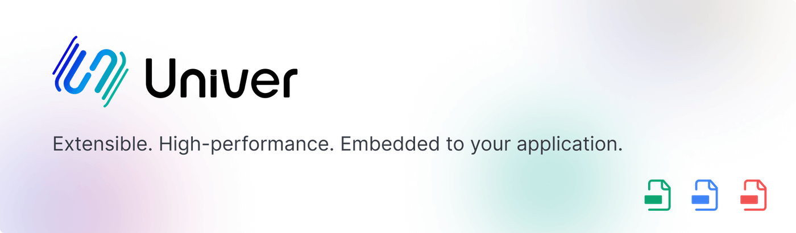

<picture>
    <source media="(prefers-color-scheme: dark)" srcset="./docs/img/banner-light.png">
    
</picture>

次世代のオフィススイート。  
拡張可能・組み込み可能・高性能

> 日本語の開発ドキュメントはまだ未完成です。英語のドキュメントをご参照ください。

[English][readme-en-link] | [简体中文][readme-zh-link] | **日本語**  
[オフィシャルサイト][official-site-link] | [ドキュメント][documentation-link] | [プレイグラウンド][playground-link] | [ブログ][blog-link]

[![][github-license-shield]][github-license-link]
[![][github-actions-shield]][github-actions-link]
[![][github-stars-shield]][github-stars-link]
[![][github-contributors-shield]][github-contributors-link]  
[![][github-forks-shield]][github-forks-link]
[![][github-issues-shield]][github-issues-link]
[![][codecov-shield]][codecov-link]
[![][codefactor-shield]][codefactor-link]
[![][discord-shield]][discord-link]

[![Trendshift][github-trending-shield]][github-trending-url]

<strong>目次</strong>

- [🌈 特徴](#-特徴)
- [✨ 機能](#-機能)
    - [📊 Univer Sheet](#-univer-sheet)
    - [📝 Univer Doc](#-univer-doc開発中)
    - [📽️ Univer Slide](#%EF%B8%8F-univer-slide開発中)
- [🌐 国際化](#-国際化)
- [👾 ショーケース](#-ショーケース)<!-- - [📦 Ecosystem](#-ecosystem) -->
- [💬 コミュニティ](#-コミュニティ)
- [🤝 コントリビュート](#-コントリビュート)
- [❤️ スポンサー](#%EF%B8%8F-スポンサー)
- [📄 ライセンス](#-ライセンス)

## 🌈 特徴

- 📈 Univer は、**スプレッドシート**と**ドキュメント**の両方をサポートするように設計されています。将来的には**スライド**もサポートされる予定です。
- ⚙️ Univer は簡単に**組み込む**ことができ、アプリケーションにシームレスに統合できます。
- 🎇 Univer は**強力**で、**数式**、**条件付き書式**、**データ検証**、**フィルタリング**、**共同編集**、**印刷**、**インポート＆エクスポート**、幅広い機能を提供しています。さらに、今後も多くの機能が追加される予定です。
- 🔌 Univer は、*プラグインアーキテクチャ*と*ファサード API*のおかげで**高い拡張性**を持ち、開発者が Univer 上で独自の要件を実装するのが楽しみになります。
- 💄 Univer は、*テーマ*を使用して外観をパーソナライズできるため、**高度にカスタマイズ可能**です。また、国際化（i18n）のサポートも提供しています。
- ⚡ Univerは**パフォーマンス**に優れています。
  - ✏️ Univer は、Canvas ベースの効率的な*レンダリングエンジン*を搭載しており、さまざまなドキュメントタイプを完璧にレンダリングできます。レンダリングエンジンは、*句読点の圧縮*、*テキストと画像のレイアウト*、*スクロールバッファリング*などの高度な組版機能をサポートしています。
  - 🧮 Univer は、Web ワーカーやサーバーサイドでも動作可能な超高速の*数式エンジン*を搭載しています。
- 🌌 Univer は**高度に統合された**システムです。ドキュメント、スプレッドシート、スライドは相互に連携でき、同じ Canvas 上にレンダリングすることもできるため、Univer 内で情報とデータの流れを実現できます。

## ✨ 機能

Univer はスプレッドシート、ドキュメント、プレゼンテーションのための幅広い機能を提供しています。以下は、いくつかの主要な機能です。

### 📊 Univer Sheet

- **コア機能**：セル、行、列、ワークシート、ワークブックなど、スプレッドシートの基本機能をサポートしています。
- **数式**：数学、統計、論理、テキスト、日付と時刻、検索と参照、エンジニアリング、金融、情報の各種数式を広範にサポートしています。
- **権限**：特定の要素へのアクセスを制限することができます。
- **数値の書式**：特定の基準に基づいて数値を書式設定することができます。
- **ハイパーリンク**：スプレッドシート内の外部ウェブサイト、電子メールアドレス、その他の場所へのリンクを可能にします。
- **浮動画像**：スプレッドシートに画像を挿入し、シート上の任意の場所に配置することができます。
- **検索と置換**：スプレッドシート内の特定のテキストを検索し、他のテキストで置換する機能を提供します。
- **フィルタリング**：特定の基準に基づいてデータをフィルタリングすることができます。
- **ソート**：特定の基準に基づいてデータをソートすることができます。
- **データ検証**：セルに入力できるデータの種類を制限する機能をサポートしています。
- **条件付き書式**：特定の基準に基づいてセルに書式を適用する機能をサポートしています。
- **コメント**：セルにコメントを追加して追加情報を提供することができます。
- **十字型ハイライト**：選択したセルを素早く特定するために、スプレッドシートに十字ハイライトを表示することができます。
- **ピボットテーブル**[^1]：データを集計して分析するためのピボットテーブルをサポートします。
- **共同編集**[^1]：複数のユーザーが同時にスプレッドシートを編集することをサポートします。
- **印刷**[^1]：スプレッドシートを印刷したり、PDF にエクスポートしたりすることができます。
- **インポート＆エクスポート**[^1]：XLSX 形式でのデータのインポートとエクスポートをサポートしています。
- **チャート**[^2]：[VChart][vchart-link] を介したサードパーティチャートのサポート。

### 📝 Univer Doc（開発中）

- **コア機能**：段落、見出し、リスト、上付き文字、下付き文字など、ドキュメントの基本機能をサポートしています。
- **リスト**：順序付きリスト、順不同リスト、タスクリストをサポートします。
- **ハイパーリンク**：ドキュメント内の外部ウェブサイト、電子メールアドレス、その他の場所へのリンクを可能にします。
- **浮動画像**：ドキュメントに画像を挿入し、テキストと画像を組み合わせて配置することができます。
- **ヘッダー＆フッター**：ドキュメントにヘッダーとフッターを追加することができます。
- **コメント**：追加情報を提供するために、ドキュメントにコメントを追加することができます。
- **インポート**[^1]：DOCX 形式でのデータのインポートをサポートしています。
- **共同編集**[^1]：複数のユーザーが同時にドキュメントを編集することをサポートします。

### 📽️ Univer Slide（開発中）

- **コア機能**：スライド、図形、テキスト、画像など、プレゼンテーションの基本機能をサポートします。

## 🌐 国際化

Univer は多言語をサポートしており、以下の言語が利用可能です：

- `zh-CN`
- `zh-TW`
- `en-US`
- `ru-RU`
- `vi-VN`
- `fa-IR`

`zh-CN` と `en-US` は公式サポート言語であり、その他の言語はコミュニティによって提供されています。

[Using Custom Locales](https://univer.ai/guides/sheet/getting-started/i18n#using-custom-locales)を使用して、追加の言語を追加することができます。また、新しい言語サポートを追加するために[貢献ガイド](/CONTRIBUTING.md)を参照してください。

## 👾 ショーケース

[Univer Examples](https://univer.ai/examples) ですべての例を見つけることができます。

| **📊 Spreadsheets** | **📊 Multi-instance** | **📊 Uniscript** |
| :---: | :---: | :---: |
| [![][examples-preview-0]][examples-link-0] | [![][examples-preview-1]][examples-link-1] | [![][examples-preview-2]][examples-link-2] |
| **📊 Big data** | **📊 Collaboration** | **📊 Collaboration Playground** |
| [![][examples-preview-3]][examples-link-3] | [![][examples-preview-4]][examples-link-4] | [![][examples-preview-5]][examples-link-5] |
| **📊 Import & Export** | **📊 Printing** | **📝 Documents** |
| [![][examples-preview-6]][examples-link-6] | [![][examples-preview-7]][examples-link-7] | [![][examples-preview-8]][examples-link-8] |
| **📝 Multi-instance** | **📝 Uniscript** | **📝 Big data** |
| [![][examples-preview-9]][examples-link-9] | [![][examples-preview-10]][examples-link-10] | [![][examples-preview-11]][examples-link-11] |
| **📝 Collaboration** | **📝 Collaboration Playground** | **📽️ Presentations** |
| [![][examples-preview-12]][examples-link-12] | [![][examples-preview-13]][examples-link-13] | [![][examples-preview-14]][examples-link-14] |
| **📊 Zen Editor** | **Univer Workspace (SaaS version)** | &nbsp; |
| [![][examples-preview-15]][examples-link-15] | [![][examples-preview-16]][examples-link-16] | &nbsp; |

<!-- ## 📦 Ecosystem

Univer has a rich ecosystem that includes a wide range of tools and resources to help you get started with Univer: -->

## 🔒 セキュリティ

Univer は、セキュアなコードベースを維持することを約束します。セキュリティのベストプラクティスに従い、依存関係を定期的に更新しています。詳細については、[セキュリティポリシー](./SECURITY.md)をご参照ください。

## 💬 コミュニティ

[![][github-community-badge]][github-community-link] [![][discord-community-badge]][discord-community-link] [![][stackoverflow-community-badge]][stackoverflow-community-link]

Univer は包括的で歓迎するプロジェクトです。コミュニティに参加する前に、[行動規範](./CODE_OF_CONDUCT.md)をお読みください。

Univer コミュニティに参加してください:

- [Discord][discord-community-link] で他の開発者とチャットする。
- [GitHub Discussions][github-community-link] でディスカッションを開始する。
- [Stack Overflow][stackoverflow-community-link] でトピックを開き、`univer` タグを付ける。

Univer は以下の場所でも見つけることができます:

[Twitter][twitter-community-link] | [YouTube][youtube-community-link]

## 🤝 コントリビュート

どのようなコントリビュートでも結構です。[問題や機能に関するリクエスト](https://github.com/dream-num/univer/issues)をお寄せください。まずは[コントビューティングガイド](./CONTRIBUTING.md)をお読みください。

Univer にコードをコントリビュートしたい方は、コントリビュートガイドもご参照ください。開発環境のセットアップからプルリクエストの提出までの手順を説明しています。

## ❤️ スポンサー

Univer プロジェクトの成長と開発は、バッカーやスポンサーのサポートに依存しています。プロジェクトをサポートしていただける方は、スポンサーになることを検討していただければ幸いです。[Open Collective](https://opencollective.com/univer) からスポンサーになることができます。

スポンサーの皆様、ありがとうございます。スペースの制限のため、一部のスポンサーのみをここに掲載しています。ランキングは特にありません。

[![][sponsor-badge-0]][sponsor-link-0]
[![][sponsor-badge-1]][sponsor-link-1]
[![][sponsor-badge-2]][sponsor-link-2]
[![][sponsor-badge-3]][sponsor-link-3]
[![][sponsor-badge-4]][sponsor-link-4]
[![][sponsor-badge-5]][sponsor-link-5]
[![][sponsor-badge-6]][sponsor-link-6]

[![][backer-badge-0]][backer-link-0]
[![][backer-badge-1]][backer-link-1]
[![][backer-badge-2]][backer-link-2]
[![][backer-badge-3]][backer-link-3]
[![][backer-badge-4]][backer-link-4]
[![][backer-badge-5]][backer-link-5]
[![][backer-badge-6]][backer-link-6]

## 📄 ライセンス

Copyright © 2021-2024 DreamNum Co,Ltd. All Rights Reserved.

[Apache-2.0](https://www.apache.org/licenses/LICENSE-2.0)ライセンスの下で配布されています。

<!-- Footnotes -->
[^1]: これらの機能は、Univer の非 OSS バージョンによって提供されています。非 OSS バージョンは商用利用には無料であり、有料のアップグレードプランも提供されています。
[^2]: VChart は Univer にチャート機能を提供するサードパーティライブラリです。詳細はこちらをご覧ください：[univer-vchart-plugin][vchart-univer-link].

<!-- Links -->
[github-license-shield]: https://img.shields.io/github/license/dream-num/univer?style=flat-square
[github-license-link]: ./LICENSE
[github-actions-shield]: https://img.shields.io/github/actions/workflow/status/dream-num/univer/build.yml?style=flat-square
[github-actions-link]: https://github.com/dream-num/univer/actions/workflows/build.yml
[github-stars-link]: https://github.com/dream-num/univer/stargazers
[github-stars-shield]: https://img.shields.io/github/stars/dream-num/univer?style=flat-square
[github-trending-shield]: https://trendshift.io/api/badge/repositories/4376
[github-trending-url]: https://trendshift.io/repositories/4376
[github-contributors-link]: https://github.com/dream-num/univer/graphs/contributors
[github-contributors-shield]: https://img.shields.io/github/contributors/dream-num/univer?style=flat-square
[github-forks-link]: https://github.com/dream-num/univer/network/members
[github-forks-shield]: https://img.shields.io/github/forks/dream-num/univer?style=flat-square
[github-issues-link]: https://github.com/dream-num/univer/issues
[github-issues-shield]: https://img.shields.io/github/issues/dream-num/univer?style=flat-square
[codecov-shield]: https://img.shields.io/codecov/c/gh/dream-num/univer?token=aPfyW2pIMN&style=flat-square
[codecov-link]: https://codecov.io/gh/dream-num/univer
[codefactor-shield]: https://www.codefactor.io/repository/github/dream-num/univer/badge/dev?style=flat-square
[codefactor-link]: https://www.codefactor.io/repository/github/dream-num/univer/overview/dev
[discord-shield]: https://img.shields.io/discord/1136129819961217077?logo=discord&logoColor=FFFFFF&label=discord&color=5865F2&style=flat-square
[discord-link]: https://discord.gg/z3NKNT6D2f

[readme-en-link]: ./README.md
[readme-zh-link]: ./README-zh.md
[readme-ja-link]: ./README-ja.md

[official-site-link]: https://univer.ai
[documentation-link]: https://univer.ai/guides/sheet/introduction
[playground-link]: https://univer.ai/playground
[blog-link]: https://univer.ai/blog/post/this-is-univer

[stackoverflow-community-link]: https://stackoverflow.com/questions/tagged/univer
[stackoverflow-community-badge]: https://img.shields.io/badge/stackoverflow-univer-ef8236?labelColor=black&logo=stackoverflow&logoColor=white&style=for-the-badge
[github-community-link]: https://github.com/dream-num/univer/discussions
[github-community-badge]: https://img.shields.io/badge/github-univer-24292e?labelColor=black&logo=github&logoColor=white&style=for-the-badge
[discord-community-link]: https://discord.gg/z3NKNT6D2f
[discord-community-badge]: https://img.shields.io/discord/1136129819961217077?color=5865F2&label=discord&labelColor=black&logo=discord&logoColor=white&style=for-the-badge
[twitter-community-link]: https://twitter.com/univerhq
[youtube-community-link]: https://www.youtube.com/@dreamNum
[zhihu-community-link]: https://www.zhihu.com/org/meng-shu-ke-ji
[segmentfault-community-link]: https://segmentfault.com/u/congrongdehongjinyu
[juejin-community-link]: https://juejin.cn/user/4312146127850733

[sponsor-link-0]: https://opencollective.com/univer/sponsor/0/website
[sponsor-link-1]: https://opencollective.com/univer/sponsor/1/website
[sponsor-link-2]: https://opencollective.com/univer/sponsor/2/website
[sponsor-link-3]: https://opencollective.com/univer/sponsor/3/website
[sponsor-link-4]: https://opencollective.com/univer/sponsor/4/website
[sponsor-link-5]: https://opencollective.com/univer/sponsor/5/website
[sponsor-link-6]: https://opencollective.com/univer/sponsor/6/website
[sponsor-badge-0]: https://opencollective.com/univer/sponsor/0/avatar.svg
[sponsor-badge-1]: https://opencollective.com/univer/sponsor/1/avatar.svg
[sponsor-badge-2]: https://opencollective.com/univer/sponsor/2/avatar.svg
[sponsor-badge-3]: https://opencollective.com/univer/sponsor/3/avatar.svg
[sponsor-badge-4]: https://opencollective.com/univer/sponsor/4/avatar.svg
[sponsor-badge-5]: https://opencollective.com/univer/sponsor/5/avatar.svg
[sponsor-badge-6]: https://opencollective.com/univer/sponsor/6/avatar.svg
[backer-link-0]: https://opencollective.com/univer/backer/0/website
[backer-link-1]: https://opencollective.com/univer/backer/1/website
[backer-link-2]: https://opencollective.com/univer/backer/2/website
[backer-link-3]: https://opencollective.com/univer/backer/3/website
[backer-link-4]: https://opencollective.com/univer/backer/4/website
[backer-link-5]: https://opencollective.com/univer/backer/5/website
[backer-link-6]: https://opencollective.com/univer/backer/6/website
[backer-badge-0]: https://opencollective.com/univer/backer/0/avatar.svg
[backer-badge-1]: https://opencollective.com/univer/backer/1/avatar.svg
[backer-badge-2]: https://opencollective.com/univer/backer/2/avatar.svg
[backer-badge-3]: https://opencollective.com/univer/backer/3/avatar.svg
[backer-badge-4]: https://opencollective.com/univer/backer/4/avatar.svg
[backer-badge-5]: https://opencollective.com/univer/backer/5/avatar.svg
[backer-badge-6]: https://opencollective.com/univer/backer/6/avatar.svg

[vchart-link]: https://github.com/VisActor/VChart
[vchart-univer-link]: https://github.com/VisActor/univer-vchart-plugin

[examples-preview-0]: ./docs/img/examples-sheets.gif
[examples-preview-1]: ./docs/img/examples-sheets-multi.gif
[examples-preview-2]: ./docs/img/examples-sheets-uniscript.gif
[examples-preview-3]: ./docs/img/examples-sheets-big-data.gif
[examples-preview-4]: ./docs/img/pro-examples-sheets-collaboration.gif
[examples-preview-5]: ./docs/img/pro-examples-sheets-collaboration-playground.gif
[examples-preview-6]: ./docs/img/pro-examples-sheets-exchange.gif
[examples-preview-7]: ./docs/img/pro-examples-sheets-print.gif
[examples-preview-8]: ./docs/img/examples-docs.gif
[examples-preview-9]: ./docs/img/examples-docs-multi.gif
[examples-preview-10]: ./docs/img/examples-docs-uniscript.gif
[examples-preview-11]: ./docs/img/examples-docs-big-data.gif
[examples-preview-12]: ./docs/img/pro-examples-docs-collaboration.gif
[examples-preview-13]: ./docs/img/pro-examples-docs-collaboration-playground.gif
[examples-preview-14]: ./docs/img/examples-slides.gif
[examples-preview-15]: ./docs/img/zen-mode.gif
[examples-preview-16]: ./docs/img/univer-workspace-drag-chart.gif
[examples-link-0]: https://univer.ai/examples/sheets/
[examples-link-1]: https://univer.ai/examples/sheets-multi/
[examples-link-2]: https://univer.ai/examples/sheets-uniscript/
[examples-link-3]: https://univer.ai/examples/sheets-big-data/
[examples-link-4]: https://univer.ai/pro/examples/sheets-collaboration/
[examples-link-5]: https://univer.ai/pro/examples/sheets-collaboration-playground/
[examples-link-6]: https://univer.ai/pro/examples/sheets-exchange/
[examples-link-7]: https://univer.ai/pro/examples/sheets-print/
[examples-link-8]: https://univer.ai/examples/docs/
[examples-link-9]: https://univer.ai/examples/docs-multi/
[examples-link-10]: https://univer.ai/examples/docs-uniscript/
[examples-link-11]: https://univer.ai/examples/docs-big-data/
[examples-link-12]: https://univer.ai/pro/examples/docs-collaboration/
[examples-link-13]: https://univer.ai/pro/examples/docs-collaboration-playground/
[examples-link-14]: https://univer.ai/examples/slides/
[examples-link-15]: https://univer.ai/guides/sheet/features/zen-editor
[examples-link-16]: https://youtu.be/kpV0MvQuFZA
