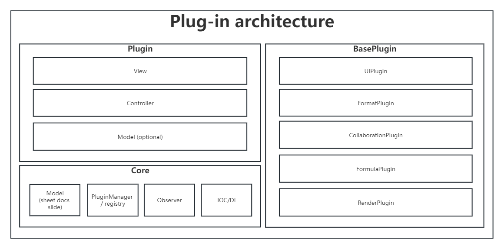
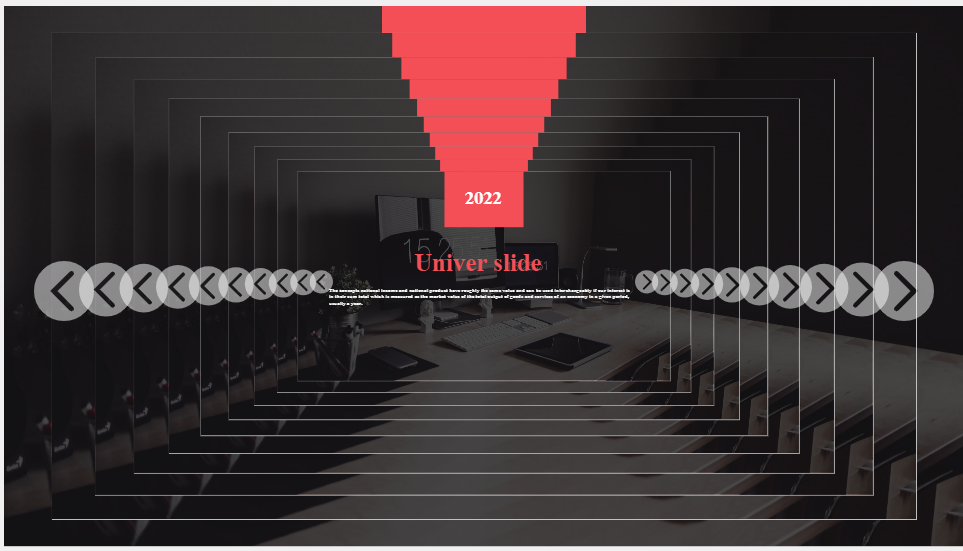
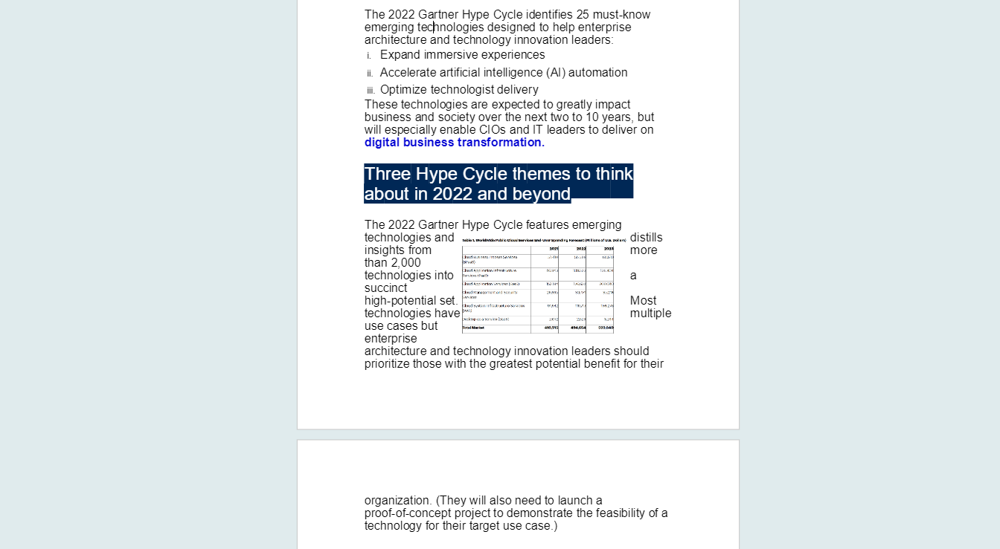

# Univer


[](https://github.com/apitable/apitable/releases/latest)
[](https://codecov.io/gh/dream-num/univer)
[](https://discord.gg/z3NKNT6D2f)

简体中文 | [English](./README.md)

## 介绍

Univer 是一个开源的协作解决方案，旨在将协作能力赋能所有系统。 接入我们之后，用户可以同步在自己的系统中查看和编辑 Microsoft Office 文件，避免上传和下载 PPT、Word、Excel。

我们在本仓库中提供了 Univer 前端代码，一套基于 Canvas 的框架，用于构建文档、电子表格和幻灯片。

> ⚠️ 该项目仍在开发中

## Demo

-   [Univer Demo](https://dream-num.github.io/univer-demo/)

## Packages

| Name                                        | Description | Version                                                                                                                     |
| :------------------------------------------ | :---------- | :-------------------------------------------------------------------------------------------------------------------------- |
| [core](./packages/core)                     | -           | [](https://npmjs.org/package/@univerjs/core)                     |
| [design](./packages/design)                 | -           | [](https://npmjs.org/package/@univerjs/design)                 |
| [docs](./packages/docs)                     | -           | [](https://npmjs.org/package/@univerjs/docs)                     |
| [docs-ui](./packages/docs-ui)               | -           | [](https://npmjs.org/package/@univerjs/docs-ui)               |
| [engine-formula](./packages/engine-formula) | -           | [](https://npmjs.org/package/@univerjs/engine-formula) |
| [engine-numfmt](./packages/engine-numfmt)   | -           | [](https://npmjs.org/package/@univerjs/engine-numfmt)   |
| [engine-render](./packages/engine-render)   | -           | [](https://npmjs.org/package/@univerjs/engine-render)   |
| [formula](./packages/formula)               | -           | [](https://npmjs.org/package/@univerjs/formula)               |
| [rpc](./packages/rpc)                       | -           | [](https://npmjs.org/package/@univerjs/rpc)                       |
| [sheets-formula](./packages/sheets-formula) | -           | [](https://npmjs.org/package/@univerjs/sheets-formula) |
| [sheets-numfmt](./packages/sheets-numfmt)   | -           | [](https://npmjs.org/package/@univerjs/sheets-numfmt)   |
| [sheets](./packages/sheets)                 | -           | [](https://npmjs.org/package/@univerjs/sheets)                 |
| [ui](./packages/ui)                         | -           | [](https://npmjs.org/package/@univerjs/ui)                         |

## 开发

### 环境

-   [node.js](https://nodejs.org) version 16.20.0
-   [pnpm](https://pnpm.io) version 8.6.2

### 安装

```
git clone http://github.com/dream-num/univer
cd univer
npm i -g pnpm # MacOS : sudo npm i -g pnpm
pnpm i
```

### 开发

启动全部

```shell
npm run dev
```

启动 sheets

```shell
npm run dev:sheet
```

启动 docs

```shell
npm run dev:doc
```

启动 slides

```shell
npm run dev:slide
```

## 社区

欢迎加入我们的 [Discord 社区](https://discord.gg/z3NKNT6D2f)。

## 问题反馈

请到 [Issues](http://github.com/dream-num/univer/issues) 提交问题。

## 关注者

[](https://github.com/dream-num/univer/stargazers)

## 整体架构

Univer 采用 typescript 编写，按照插件化架构进行设计，核心外的功能都以插件的形式进行开发，今后会建设插件市场，满足更加个性化的需求


## 渲染引擎

Univer sheet, document, slide 采用同一套渲染引擎架构，把应用抽象为文本流，表格，画布，core 部分触发渲染，object 为渲染器。


1. 做到了应用互相间的嵌套和操作。
2. sheet 单元格支持嵌入 doc 文字
3. slide 中支持插入 sheet，doc，slide

|     slide 10-layer embedding      |         Sheet in slide and doc in cell         |   wrap text around a picture    |
| :-------------------------------: | :--------------------------------------------: | :-----------------------------: |
|  |  |  |

## 公式引擎

Univer 自研公式引擎，支持异步计算, lambda 函数及范围命名


