

    <picture>
        <source media="(prefers-color-scheme: dark)" srcset="./docs/img/banner-light.png">
        
    </picture>

    
    
    
    
    

    <a href="./README.md">English</a>
    |
    简体中文
    |
    <a href="./README-ja.md">日本語</a>

<!-- An introduction photo here. -->

> 🚧 该项目仍在开发中，请注意可能会有较大的 API 变更。欢迎向我们提交问题以及建议。

## 介绍

Univer 是一套企业文档与数据协同解决方案，融合了电子表格、文档和幻灯片。

Univer 的亮点包括：

- 📈 **支持多种类文档** Univer 目前支持**电子表格**和**富文本文档**，未来还会增加对**幻灯片**的支持。
- ⚙️ **易于集成** Univer 能够无缝集成到你的应用当中。
- 🎇 **功能强大** Univer 支持非常多的功能，包括但不限于**公式计算**、**条件格式**、**数据验证**、**筛选**、**协同编辑**、**打印**、**导入导出**等等，更多的功能即将陆续发布。
- 🔌 **高度可扩展**Univer 的 *插件化架构* 和 *Facade API* 使得扩展 Univer 的功能变得轻松容易，你可以在 Univer 之上实现自己的业务需求。
- 💄 **高度可定制** 你可以通过*主题*来自定义 Univer 的外观，另外还支持国际化。
- ⚡ **性能优越**
  - ✏️ Univer 实现了基于 canvas 的 *渲染引擎*，能够高效地渲染不同类型的文档。渲染引擎支持 *标点挤压* *盘古之白* *图文混排* *滚动贴图* 等高级特性。
  - 🧮 自研的 *公式引擎* 拥有超快的计算速度，还能在 Web Worker 中运行，未来将会支持服务端计算。
- 🌌 **高度集成** 文档、电子表格和幻灯片能够互操作，甚至是渲染在同一个画布上，使得信息和数据能够在 Univer 当中自由地流动。

## 例子

| &nbsp; | &nbsp; | &nbsp; |
| :---: | :---: | :---: |
| 📊 Sheets | 📊 Sheets Multi | 📊 Sheets Uniscript |
| [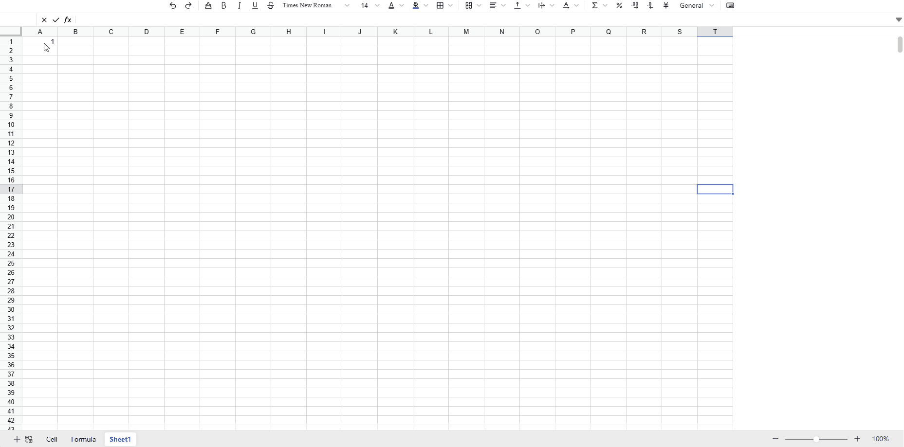](https://univer.ai/examples/sheets/) | [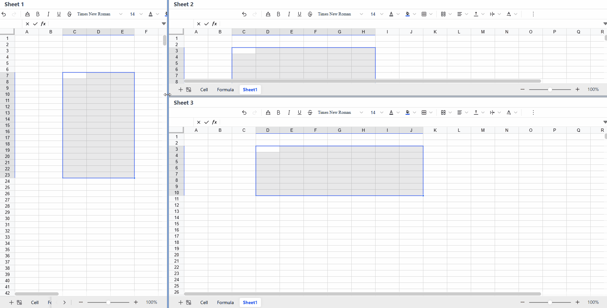](https://univer.ai/examples/sheets-multi/) | [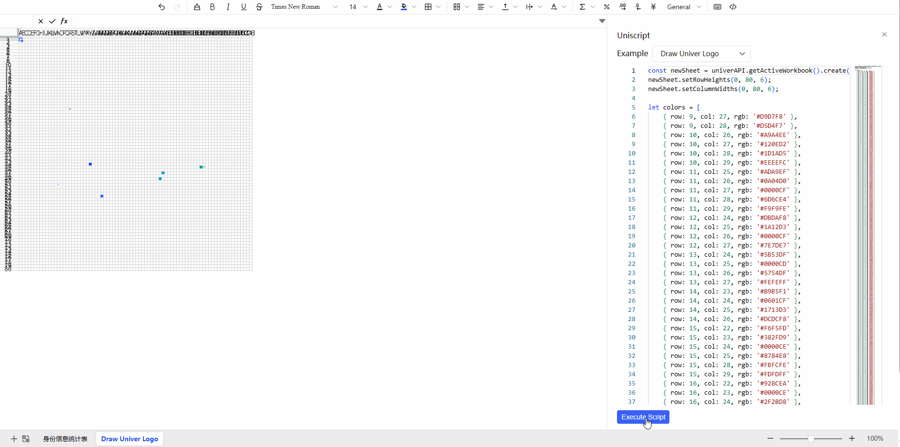](https://univer.ai/examples/sheets-uniscript/) |
| 📊 Sheets Big Data | 📊 Sheets Collaboration (Pro) | 📊 Sheets Collaboration Playground (Pro) |
| [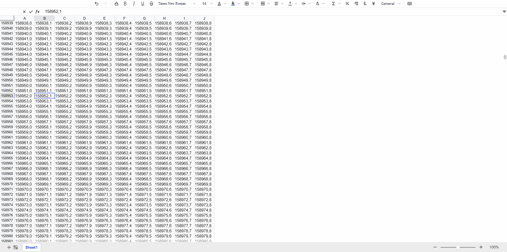](https://univer.ai/examples/sheets-big-data/) | [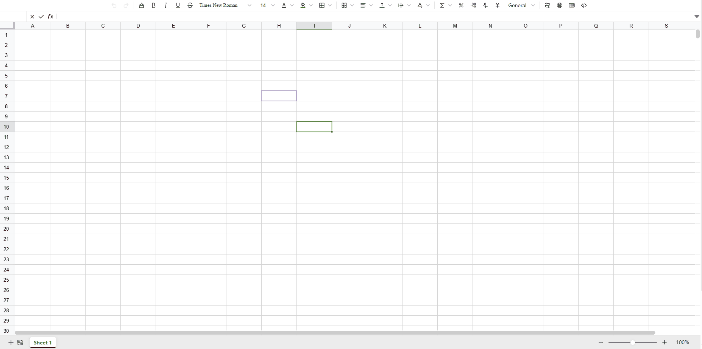](https://univer.ai/pro/examples/sheets-collaboration/) | [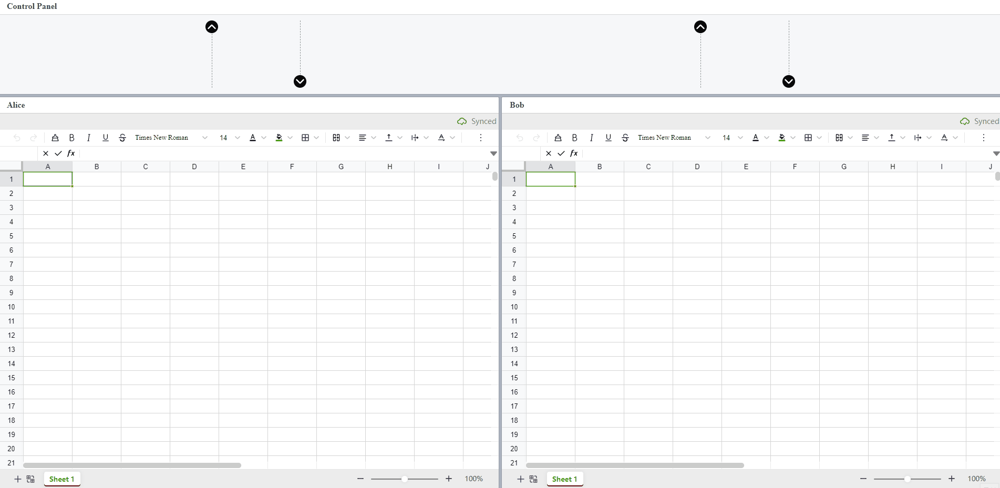](https://univer.ai/pro/examples/sheets-collaboration-playground/) |
| 📊 Sheets Import/Export (Pro) | 📊 Sheets Print (Pro) | 📝 Docs |
| [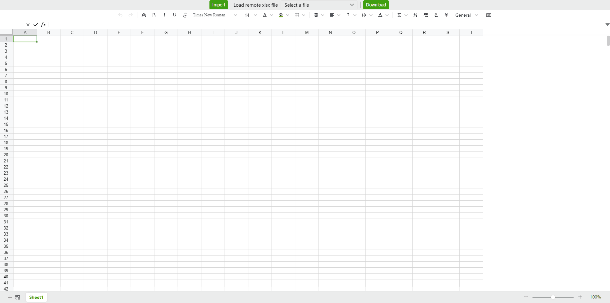](https://univer.ai/pro/examples/sheets-exchange/) | [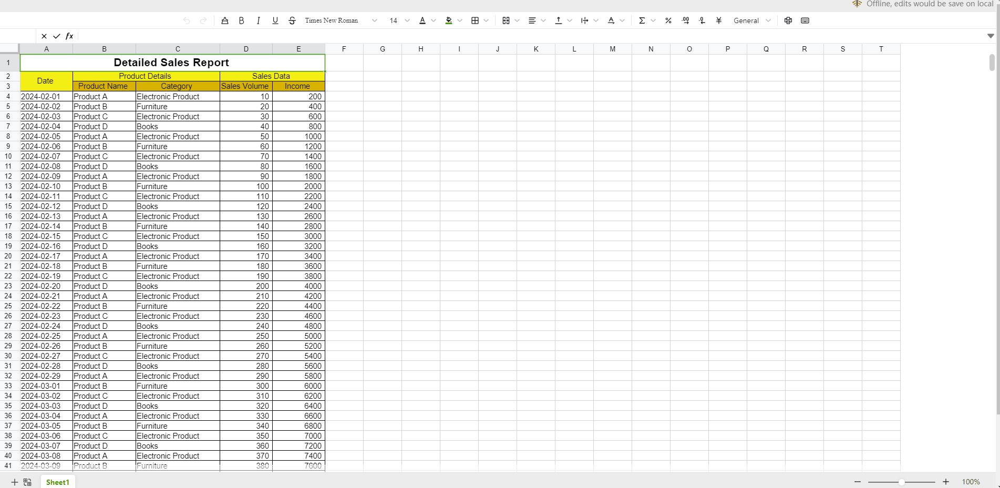](https://univer.ai/pro/examples/sheets-print/) | [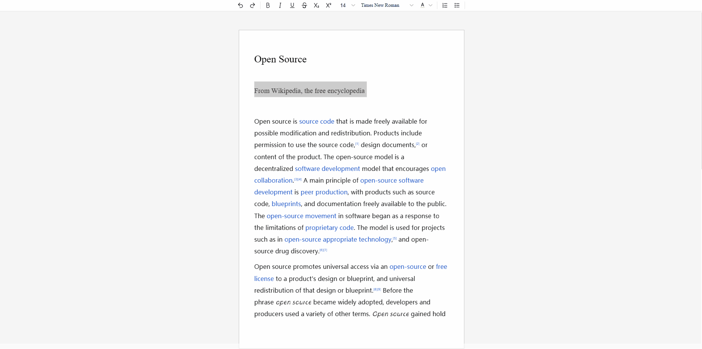](https://univer.ai/examples/docs/) |
| 📝 Docs Multi | 📝 Docs Uniscript | 📝 Docs Big Data |
| [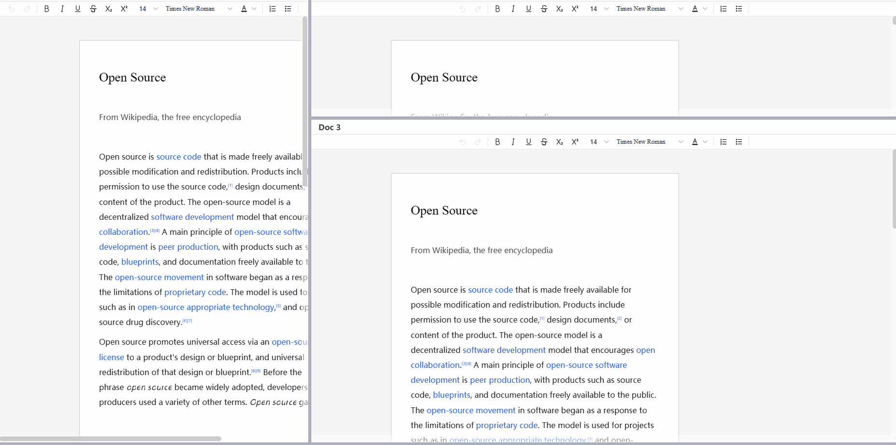](https://univer.ai/examples/docs-multi/) |  | [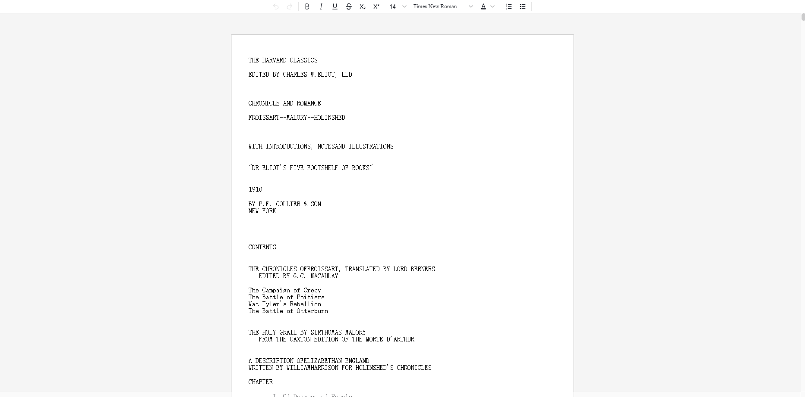](https://univer.ai/examples/docs-big-data/) |
| 📝 Docs Collaboration (Pro) | 📝 Docs Collaboration Playground (Pro) | 📽️ Slides |
|  | [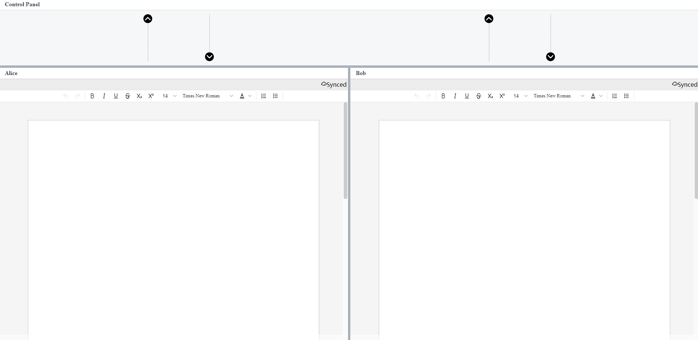](https://univer.ai/pro/examples/docs-collaboration-playground/) | [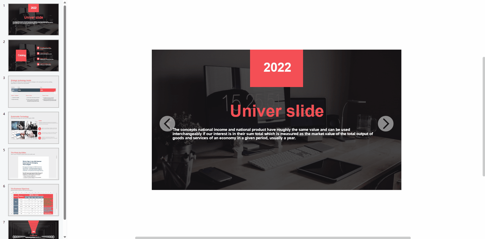](https://univer.ai/examples/slides/) |
| 📊 Zen Mode | Univer Workspace (SaaS version) | &nbsp; |
| [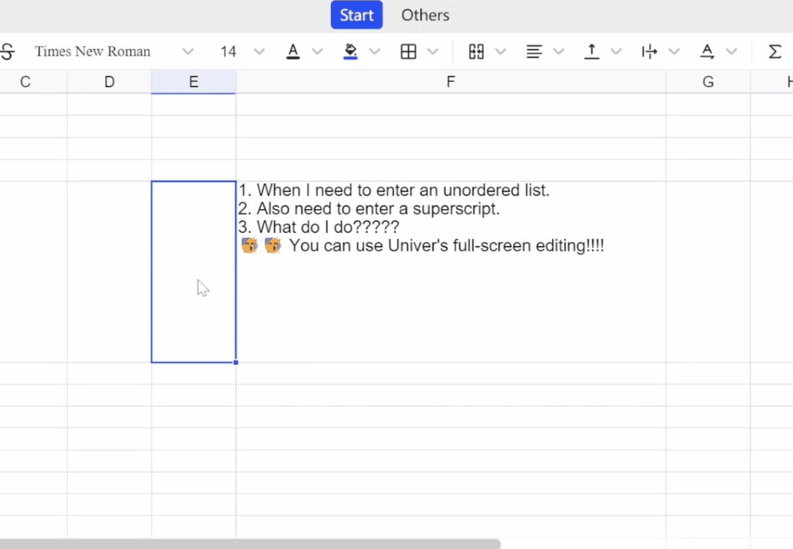](https://univer.ai/zh-CN/guides/sheet/tutorials/zen-editor/#%E6%BC%94%E7%A4%BA) | [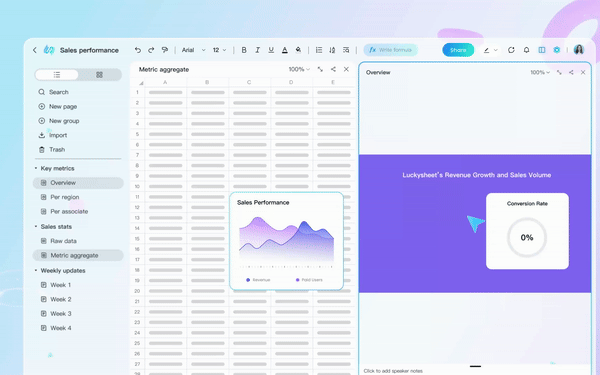](https://youtu.be/kpV0MvQuFZA) | &nbsp; |

## 使用

我们建议通过将 Univer 作为 npm 包使用，请参考文档上的[快速开始](https://univer.ai/zh-CN/guides/sheet/getting-started/quickstart)小节。我们还准备了一个[在线 playground](https://univer.ai/playground/)，你无需在本地安装 Univer 就可以体验使用 Univer 开发。

Univer 基于插件化架构设计，你可以安装以下包来增强 Univer 的功能。

### Packages

| 包名                                                    | 描述                                                                                    | 版本                                                                                                                        |
| :-------------------------------------------            | :-------------------------------------------------------------------------------------- | :-------------------------------------------------------------------------------------------------------------------------- |
| [core](./packages/core)                                 | Univer 核心包，实现 Univer 架构和插件机制、基础服务，以及各个文档类型的基本模型         |                      |
| [data-validation](./packages/data-validation)           | 实现了 Univer 的数据验证功能                                                            |  |
| [design](./packages/design)                             | 实现 Univer 设计语言，提供了一套 CSS 以及一套基于 React 的组件                          |                  |
| [docs](./packages/docs)                                 | 实现了富文本文档的基本业务，同时支持其他业务的文本编辑                                  |                      |
| [docs-ui](./packages/docs-ui)                           | 实现了富文本文档的用户交互                                                              |                |
| [engine-formula](./packages/engine-formula)             | 实现公式引擎                                                                            |  |
| [engine-numfmt](./packages/engine-numfmt)               | 实现数字格式引擎                                                                        |    |
| [engine-render](./packages/engine-render)               | 实现渲染引擎                                                                            |    |
| [facade](./packages/facade/)                            | 提供了一个让 Univer 更加易用的 API 层                                                      |                        |
| [find-replace](./packages/find-replace)                 | 实现 Univer 的查找替换                                                                             |          |
| [network](./packages/network)                           | 实现了 Univer 的网络服务，包括 WebSocket 和 HTTP。                                      |                |
| [rpc](./packages/rpc)                                   | 实现 RPC 机制，以及在主从文档副本之间同步数据的方法，方便 web worker 等跨线程场景的开发 |                        |
| [sheets](./packages/sheets)                             | 实现电子表格的基本业务                                                                  |                  |
| [sheets-conditional-formatting](./packages/sheets-conditional-formatting)   | 实现电子表格的条件格式功能                                               |  |
| [sheets-conditional-formatting-ui](./packages/sheets-conditional-formatting-ui)   | 实现电子表格的条件格式功能                                               |  |
| [sheets-data-validation](./packages/sheets-data-validation) | 实现电子表格的数据验证功能                                                            |  |
| [sheets-find-replace](./packages/sheets-find-replace)   | 实现电子表格的查找替换                                                                  |  |
| [sheets-formula](./packages/sheets-formula)             | 实现电子表格的公式编辑                                                                  |  |
| [sheets-numfmt](./packages/sheets-numfmt)               | 实现电子表格中的数字格式编辑                                                            |    |
| [sheets-zen-editor](./packages/sheets-zen-editor)       | 实现电子表格中的禅编辑模式                                                            |    |
| [sheets-ui](./packages/sheets-ui)                       | 实现电子表格的用户交互                                                                  |            |
| [ui](./packages/ui)                                     | 实现基本的用户交互服务，并基于 React 提供了一套桌面端的交互布局                         |                          |
| [uniscript](./packages/uniscript) （实验性）              | 一套基于 TypeScript 的 DSL，让用户可以通过脚本语言操纵 Univer 完成更复杂的任务          |            |

## 贡献

我们欢迎各种形式的贡献，你可以向我们提交[问题或功能请求](https://github.com/dream-num/univer/issues)。请先阅读我们的[贡献指南](./CONTRIBUTING.md)。

如果你想要提交代码，也请先阅读贡献指南，它会指导你如何在本地搭建开发环境以及提交 pull request。

## 赞助

Univer 持续稳定发展离不开它的支持者和赞助者，如果你想要支持我们的项目，请考虑成为我们的赞助者。你可以通过 [Open Collective](https://opencollective.com/univer) 赞助我们。

感谢支持我们的赞助者，受篇幅限制，仅列举部分，排名不分先后：

## 关注者

## 链接

- [文档](https://univer.ai/zh-CN/guides/sheet/introduction)
- [在线 Playground](https://univer.ai/playground/)
- [官方网站](https://univer.ai)

### 社区

- [Discord 社区](https://discord.gg/XPGnMBmpd6)
- [Github Discussions](https://github.com/dream-num/univer/discussions)
- 微信扫描下方二维码，加入 Univer 中文社群

## 授权

Univer 基于 Apache-2.0 协议分发。

---

Copyright © 2019-2024 Shanghai DreamNum Technology Co., Ltd. All rights reserved
