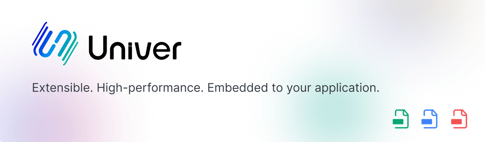

<picture>
    <source media="(prefers-color-scheme: dark)" srcset="./docs/img/banner-light.png">
    
</picture>

Univer 是一个开源的办公套件引擎，旨在为开发者提供一个强大、灵活且易于使用的办公套件解决方案。它专注于电子表格的创建与编辑，提供丰富的功能和高度的可扩展性。 
**可扩展 · 可嵌入 · 高性能** 

[English][readme-en-link] | **简体中文** | [日本語][readme-ja-link] | [Español][readme-es-link]  
[官网][official-site-link] | [文档][documentation-link] | [在线体验][playground-link] | [博客][blog-link]

[![][github-license-shield]][github-license-link]
[![][github-actions-shield]][github-actions-link]
[![][github-stars-shield]][github-stars-link]
[![][github-contributors-shield]][github-contributors-link]  
[![][github-forks-shield]][github-forks-link]
[![][github-issues-shield]][github-issues-link]
[![][codecov-shield]][codecov-link]
[![][codefactor-shield]][codefactor-link]
[![][discord-shield]][discord-link]

[![Trendshift][github-trending-shield]][github-trending-url]

通过 [Univer Platform](https://github.com/dream-num/univer-mcp)，用自然语言驱动 Univer Spreadsheets，构建 AI-Native Spreadsheet。

https://github.com/user-attachments/assets/7429bd5f-d769-4057-9e67-353337531024

<strong>目录</strong>

- [🌈 亮点](#-亮点)
- [✨ 特性](#-特性)
    - [📊 Univer Sheet](#-univer-sheet)
    - [📝 Univer Doc](#-univer-doc积极开发中)
    - [📽️ Univer Slide](#%EF%B8%8F-univer-slide积极开发中)
- [🌐 国际化](#-国际化)
- [👾 在线示例](#-在线示例)<!-- - [📦 生态系统](#-生态系统) -->
- [💬 社区](#-社区)
- [🤝 贡献](#-贡献)
- [❤️ 赞助](#%EF%B8%8F-赞助)
- [📄 许可](#-许可)

## 🌈 亮点

- 📈 **支持多种类文档** Univer 目前支持**电子表格**和**富文本文档**，未来还会增加对**幻灯片**的支持。
- 🧙‍♀️ **多端同构** 可以在浏览器和 Node.js 环境中运行。
- ⚙️ **易于集成** Univer 能够无缝集成到你的应用当中。
- 🎇 **功能强大** Univer 支持非常多的功能，包括但不限于**公式计算**、**条件格式**、**数据验证**、**筛选**、**协同编辑**、**打印**、**导入导出**等等，更多的功能即将陆续发布。
- 🔌 **高度可扩展** Univer 的*插件化架构*使得扩展 Univer 的功能变得轻松容易，你可以在 Univer 之上实现自己的业务需求。
- 💄 **高度可定制** 你可以通过*主题*来自定义 Univer 的外观，另外还支持国际化。
- 🥤 **易于使用** *Presets* 和 *Facade API* 使得 Univer 很容易上手
- ⚡ **性能优越**
  - ✏️ Univer 实现了基于 canvas 的*渲染引擎*，能够高效地渲染不同类型的文档。渲染引擎支持 *标点挤压* *盘古之白* *图文混排* *滚动贴图* 等高级特性。
  - 🧮 自研的 *公式引擎* 拥有超快的计算速度，还能在 Web Worker 中运行，未来将会支持服务端计算。
- 🌌 **高度集成** 文档、电子表格和幻灯片能够互操作，甚至是渲染在同一个画布上，使得信息和数据能够在 Univer 当中自由地流动。

## ✨ 特性

Univer 提供了丰富的电子表格、文档和幻灯片功能。以下是一些主要功能：

### 📊 Univer Sheets

- **核心功能**：Univer 支持电子表格的核心功能，包括单元格、行、列、工作表和工作簿。
- **公式**：支持各种公式，包括数学、统计、逻辑、文本、日期和时间、查找和引用、工程、金融和信息公式。
- **权限**：允许限制对特定元素的访问。
- **数字格式化**：支持根据特定条件格式化数字。
- **超链接**：支持在电子表格中链接到外部网站、电子邮件地址和其他位置。
- **浮动图片**：允许将图片插入到电子表格中，并将其放置在表格的任何位置。
- **查找和替换**：提供在电子表格中搜索特定文本并将其替换为其他文本的功能。
- **筛选**：允许根据特定条件筛选数据。
- **排序**：允许根据特定条件对数据进行排序。
- **数据验证**：支持限制可以输入单元格的数据类型。
- **条件格式**：支持根据特定条件对单元格应用格式。
- **评论**：允许向单元格添加评论以提供额外信息。
- **十字高亮**：支持在电子表格中显示十字高亮，以帮助用户快速定位选中的单元格。
- **禅模式**：提供一个无干扰的编辑体验，具有干净的界面和最小的干扰。
- **数据透视表**[^1]：支持数据透视表，允许用户对数据进行汇总和分析。
- **迷你图**[^1]：支持迷你图，它是适合单元格内的小型图表，用于提供数据的可视化表示。
- **打印**[^1]：允许打印电子表格或将其导出为 PDF。
- **导入和导出**[^1]：支持导入导出 XLSX 格式的数据。
- **图表**[^1]：支持各种类型的图表，包括柱状图、折线图、饼图、散点图等。
- **协同编辑**[^1]：支持多个用户同时编辑电子表格，同时支持历史记录与恢复。
- **编辑历史**[^1]：允许用户查看和恢复电子表格的先前版本。

### 📝 Univer Docs（rc）

- **核心功能**：Univer 支持文档的核心功能，包括段落、标题、列表、上标、下标等。
- **列表**：支持有序列表、无序列表和任务列表。
- **超链接**：支持在文档中插入外部网站、电子邮件地址的链接。
- **浮动图片**：允许将图片插入到文档中，并支持图文混合排版。
- **页眉 & 页脚**：允许向文档添加页眉和页脚。
- **评论**：允许向文档添加评论以提供额外信息。
- **打印**[^1]：允许打印文档或将其导出为 PDF。
- **导入和导出**[^1]：支持导入导出 DOCX 格式的数据。
- **协同编辑**[^1]：支持多个用户同时编辑文档。

### 📽️ Univer Slides（开发中）

- **核心功能**：Univer 将支持幻灯片的核心功能，包括幻灯片、形状、文本、图片等。

## 🌐 国际化

Univer 内置多种语言支持，包括：

- `ca-ES`
- `en-US`
- `es-ES`
- `fa-IR`
- `ja-JP`
- `ko-KR`
- `ru-RU`
- `sk-SK`
- `vi-VN`
- `zh-CN`
- `zh-TW`

其中 `zh-CN` 和 `en-US` 由官方支持，其余为社区贡献。

你可以通过[自定义语言包](https://docs.univer.ai/guides/sheets/getting-started/i18n#%E8%87%AA%E5%AE%9A%E4%B9%89%E8%AF%AD%E8%A8%80%E5%8C%85)来添加你想要的语言。也可以参考[贡献指南](/CONTRIBUTING.md)来帮助我们添加新的语言支持。

## 👾 在线示例

在 AI 产品中嵌入 Univer，作为数据展示工具。

[![][examples-preview-biaoda]][examples-link-biaoda]

你可以在 [Univer Examples](https://docs.univer.ai/showcase) 中找到所有的示例。

| **📊 Spreadsheets** | **📊 Multi-instance** | **📊 Uniscript** |
| :---: | :---: | :---: |
| [![][examples-preview-0]][examples-link-0] | [![][examples-preview-1]][examples-link-1] | [![][examples-preview-2]][examples-link-2] |
| **📊 Big data** | **📊 Collaboration** | **📊 Collaboration Playground** |
| [![][examples-preview-3]][examples-link-3] | [![][examples-preview-4]][examples-link-4] | [![][examples-preview-5]][examples-link-5] |
| **📊 Import & Export** | **📊 Printing** | **📝 Documents** |
| [![][examples-preview-6]][examples-link-6] | [![][examples-preview-7]][examples-link-7] | [![][examples-preview-8]][examples-link-8] |
| **📝 Multi-instance** | **📝 Uniscript** | **📝 Big data** |
| [![][examples-preview-9]][examples-link-9] | [![][examples-preview-10]][examples-link-10] | [![][examples-preview-11]][examples-link-11] |
| **📝 Collaboration** | **📝 Collaboration Playground** | **📽️ Presentations** |
| [![][examples-preview-12]][examples-link-12] | [![][examples-preview-13]][examples-link-13] | [![][examples-preview-14]][examples-link-14] |
| **📊 Zen Editor** | **Univer Workspace (SaaS version)** | &nbsp; |
| [![][examples-preview-15]][examples-link-15] | [![][examples-preview-16]][examples-link-16] | &nbsp; |

<!-- ## 📦 生态

Univer has a rich ecosystem that includes a wide range of tools and resources to help you get started with Univer: -->

## 🔒 安全

Univer 致力于维护一个安全的代码库。我们遵循安全最佳实践并定期更新我们的依赖项。有关更多信息，请参阅我们的[安全政策](./SECURITY.md)。

## 💬 社区

[![][github-community-badge]][github-community-link] [![][discord-community-badge]][discord-community-link] [![][stackoverflow-community-badge]][stackoverflow-community-link]

Univer 是一个包容和友好的项目。在参与社区之前，请阅读我们的[行为准则](./CODE_OF_CONDUCT.md)。

加入 Univer 社区：

- 在 [Discord][discord-community-link] 上与我们和其他开发者聊天。
- 在 [GitHub Discussions][github-community-link] 上开始一个讨论。
- 在 [Stack Overflow][stackoverflow-community-link] 上开一个话题，并标记为 `univer`。
- 微信扫描下方二维码，加入 Univer 中文社群

你也可以在以下社交平台找到 Univer：

[Twitter][twitter-community-link] | [YouTube][youtube-community-link] | [知乎][zhihu-community-link] | [SegmentFault][segmentfault-community-link] | [掘金][juejin-community-link]

## 🤝 贡献

我们欢迎各种形式的贡献，你可以向我们提交[问题或功能请求](https://github.com/dream-num/univer/issues)。请先阅读我们的[贡献指南](./CONTRIBUTING.md)。

如果你想要提交代码，也请先阅读贡献指南，它会指导你如何在本地搭建开发环境以及提交 pull request。

## ❤️ 赞助

Univer 持续稳定发展离不开它的支持者和赞助者，如果你想要支持我们的项目，请考虑成为我们的赞助者。你可以通过 [Open Collective](https://opencollective.com/univer) 赞助我们。

感谢支持我们的赞助者，受篇幅限制，仅列举部分，排名不分先后：

[![][sponsor-badge-0]][sponsor-link-0]
[![][sponsor-badge-1]][sponsor-link-1]
[![][sponsor-badge-2]][sponsor-link-2]
[![][sponsor-badge-3]][sponsor-link-3]
[![][sponsor-badge-4]][sponsor-link-4]
[![][sponsor-badge-5]][sponsor-link-5]
[![][sponsor-badge-6]][sponsor-link-6]

[![][backer-badge-0]][backer-link-0]
[![][backer-badge-1]][backer-link-1]
[![][backer-badge-2]][backer-link-2]
[![][backer-badge-3]][backer-link-3]
[![][backer-badge-4]][backer-link-4]
[![][backer-badge-5]][backer-link-5]
[![][backer-badge-6]][backer-link-6]

## 📄 许可

Copyright © 2021-2025 DreamNum Co,Ltd. All Rights Reserved.

基于 [Apache-2.0](https://www.apache.org/licenses/LICENSE-2.0) 协议分发.

<!-- Footnotes -->
[^1]: 这些功能是由 Univer 的闭源部分提供的，该版本亦可用于商业用途，还包括付费升级计划。

<!-- Links -->
[github-license-shield]: https://img.shields.io/github/license/dream-num/univer?style=flat-square
[github-license-link]: ./LICENSE
[github-actions-shield]: https://img.shields.io/github/actions/workflow/status/dream-num/univer/build.yml?style=flat-square
[github-actions-link]: https://github.com/dream-num/univer/actions/workflows/build.yml
[github-stars-link]: https://github.com/dream-num/univer/stargazers
[github-stars-shield]: https://img.shields.io/github/stars/dream-num/univer?style=flat-square
[github-trending-shield]: https://trendshift.io/api/badge/repositories/4376
[github-trending-url]: https://trendshift.io/repositories/4376
[github-contributors-link]: https://github.com/dream-num/univer/graphs/contributors
[github-contributors-shield]: https://img.shields.io/github/contributors/dream-num/univer?style=flat-square
[github-forks-link]: https://github.com/dream-num/univer/network/members
[github-forks-shield]: https://img.shields.io/github/forks/dream-num/univer?style=flat-square
[github-issues-link]: https://github.com/dream-num/univer/issues
[github-issues-shield]: https://img.shields.io/github/issues/dream-num/univer?style=flat-square
[codecov-shield]: https://img.shields.io/codecov/c/gh/dream-num/univer?token=aPfyW2pIMN&style=flat-square
[codecov-link]: https://codecov.io/gh/dream-num/univer
[codefactor-shield]: https://www.codefactor.io/repository/github/dream-num/univer/badge/dev?style=flat-square
[codefactor-link]: https://www.codefactor.io/repository/github/dream-num/univer/overview/dev
[discord-shield]: https://img.shields.io/discord/1136129819961217077?logo=discord&logoColor=FFFFFF&label=discord&color=5865F2&style=flat-square
[discord-link]: https://discord.gg/z3NKNT6D2f

[readme-en-link]: ./README.md
[readme-zh-link]: ./README-zh.md
[readme-ja-link]: ./README-ja.md
[readme-es-link]: ./README-es.md

[official-site-link]: https://univer.ai/zh-CN
[documentation-link]: https://docs.univer.ai/zh-CN
[playground-link]: https://docs.univer.ai/zh-CN/showcase
[blog-link]: https://docs.univer.ai/zh-CN/blog

[stackoverflow-community-link]: https://stackoverflow.com/questions/tagged/univer
[stackoverflow-community-badge]: https://img.shields.io/badge/stackoverflow-univer-ef8236?labelColor=black&logo=stackoverflow&logoColor=white&style=for-the-badge
[github-community-link]: https://github.com/dream-num/univer/discussions
[github-community-badge]: https://img.shields.io/badge/github-univer-24292e?labelColor=black&logo=github&logoColor=white&style=for-the-badge
[discord-community-link]: https://discord.gg/z3NKNT6D2f
[discord-community-badge]: https://img.shields.io/discord/1136129819961217077?color=5865F2&label=discord&labelColor=black&logo=discord&logoColor=white&style=for-the-badge
[twitter-community-link]: https://twitter.com/univerhq
[youtube-community-link]: https://www.youtube.com/@dreamNum
[zhihu-community-link]: https://www.zhihu.com/org/meng-shu-ke-ji
[segmentfault-community-link]: https://segmentfault.com/u/congrongdehongjinyu
[juejin-community-link]: https://juejin.cn/user/4312146127850733

[sponsor-link-0]: https://opencollective.com/univer/sponsor/0/website
[sponsor-link-1]: https://opencollective.com/univer/sponsor/1/website
[sponsor-link-2]: https://opencollective.com/univer/sponsor/2/website
[sponsor-link-3]: https://opencollective.com/univer/sponsor/3/website
[sponsor-link-4]: https://opencollective.com/univer/sponsor/4/website
[sponsor-link-5]: https://opencollective.com/univer/sponsor/5/website
[sponsor-link-6]: https://opencollective.com/univer/sponsor/6/website
[sponsor-badge-0]: https://opencollective.com/univer/sponsor/0/avatar.svg
[sponsor-badge-1]: https://opencollective.com/univer/sponsor/1/avatar.svg
[sponsor-badge-2]: https://opencollective.com/univer/sponsor/2/avatar.svg
[sponsor-badge-3]: https://opencollective.com/univer/sponsor/3/avatar.svg
[sponsor-badge-4]: https://opencollective.com/univer/sponsor/4/avatar.svg
[sponsor-badge-5]: https://opencollective.com/univer/sponsor/5/avatar.svg
[sponsor-badge-6]: https://opencollective.com/univer/sponsor/6/avatar.svg
[backer-link-0]: https://opencollective.com/univer/backer/0/website
[backer-link-1]: https://opencollective.com/univer/backer/1/website
[backer-link-2]: https://opencollective.com/univer/backer/2/website
[backer-link-3]: https://opencollective.com/univer/backer/3/website
[backer-link-4]: https://opencollective.com/univer/backer/4/website
[backer-link-5]: https://opencollective.com/univer/backer/5/website
[backer-link-6]: https://opencollective.com/univer/backer/6/website
[backer-badge-0]: https://opencollective.com/univer/backer/0/avatar.svg
[backer-badge-1]: https://opencollective.com/univer/backer/1/avatar.svg
[backer-badge-2]: https://opencollective.com/univer/backer/2/avatar.svg
[backer-badge-3]: https://opencollective.com/univer/backer/3/avatar.svg
[backer-badge-4]: https://opencollective.com/univer/backer/4/avatar.svg
[backer-badge-5]: https://opencollective.com/univer/backer/5/avatar.svg
[backer-badge-6]: https://opencollective.com/univer/backer/6/avatar.svg

[examples-preview-biaoda]: ./docs/img/examples-sheets-biaoda.gif
[examples-preview-0]: ./docs/img/examples-sheets.gif
[examples-preview-1]: ./docs/img/examples-sheets-multi.gif
[examples-preview-2]: ./docs/img/examples-sheets-uniscript.gif
[examples-preview-3]: ./docs/img/examples-sheets-big-data.gif
[examples-preview-4]: ./docs/img/pro-examples-sheets-collaboration.gif
[examples-preview-5]: ./docs/img/pro-examples-sheets-collaboration-playground.gif
[examples-preview-6]: ./docs/img/pro-examples-sheets-exchange.gif
[examples-preview-7]: ./docs/img/pro-examples-sheets-print.gif
[examples-preview-8]: ./docs/img/examples-docs.gif
[examples-preview-9]: ./docs/img/examples-docs-multi.gif
[examples-preview-10]: ./docs/img/examples-docs-uniscript.gif
[examples-preview-11]: ./docs/img/examples-docs-big-data.gif
[examples-preview-12]: ./docs/img/pro-examples-docs-collaboration.gif
[examples-preview-13]: ./docs/img/pro-examples-docs-collaboration-playground.gif
[examples-preview-14]: ./docs/img/examples-slides.gif
[examples-preview-15]: ./docs/img/zen-mode.gif
[examples-preview-16]: ./docs/img/univer-workspace-drag-chart.gif
[examples-link-biaoda]: https://biaoda.me/
[examples-link-0]: https://docs.univer.ai/showcase
[examples-link-1]: https://docs.univer.ai/showcase
[examples-link-2]: https://docs.univer.ai/showcase
[examples-link-3]: https://docs.univer.ai/showcase
[examples-link-4]: https://docs.univer.ai/showcase
[examples-link-5]: https://docs.univer.ai/showcase
[examples-link-6]: https://docs.univer.ai/showcase
[examples-link-7]: https://docs.univer.ai/showcase
[examples-link-8]: https://docs.univer.ai/showcase
[examples-link-9]: https://docs.univer.ai/showcase
[examples-link-10]: https://docs.univer.ai/showcase
[examples-link-11]: https://docs.univer.ai/showcase
[examples-link-12]: https://docs.univer.ai/showcase
[examples-link-13]: https://docs.univer.ai/showcase
[examples-link-14]: https://docs.univer.ai/showcase
[examples-link-15]: https://univer.ai/zh-CN/guides/sheet/features/zen-editor
[examples-link-16]: https://youtu.be/kpV0MvQuFZA
