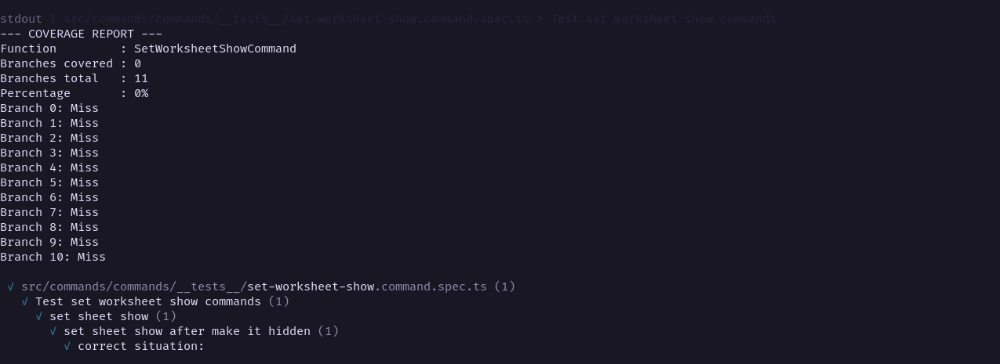
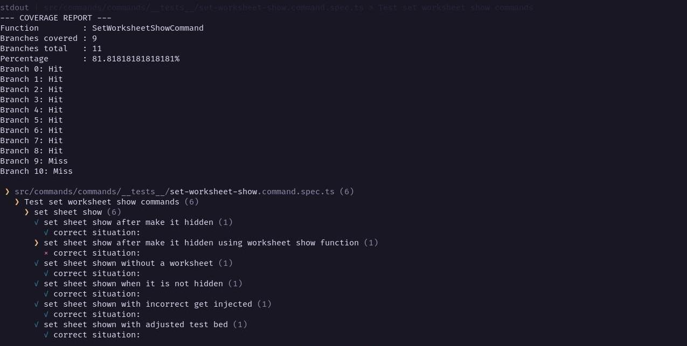
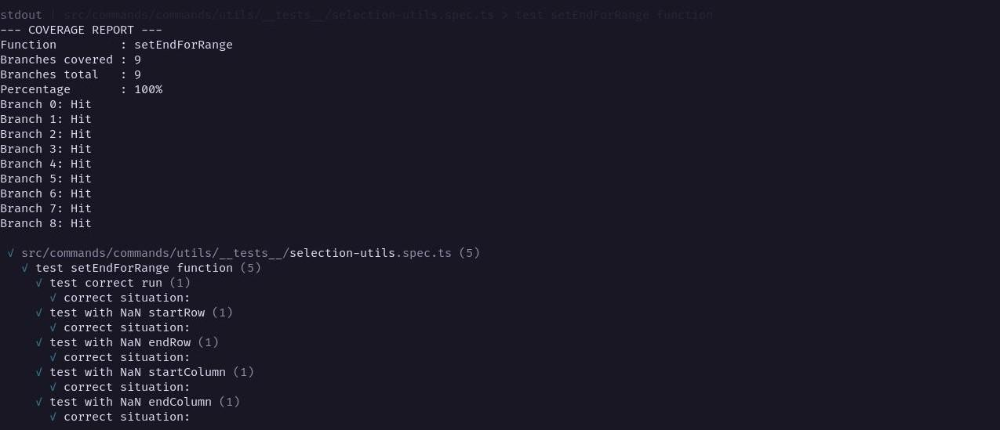

# Report for Assignment 1

## Project chosen

Name: Univer

URL: [https://github.com/dream-num/univer](https://github.com/dream-num/univer)

Number of lines of code and the tool used to count it: 226237 counted through Lizard

Programming language: Typescript

## Coverage measurement

### Existing tool

<Inform the name of the existing tool that was executed and how it was executed>

<Show the coverage results provided by the existing tool with a screenshot>

### Your own coverage tool

<The following is supposed to be repeated for each group member>

#### Team Member: Sanjay Chacku Purakal

##### SetWorksheetShowCommand()

[Github Commit](https://github.com/JariRoossien/univer/tree/521c2d1cff201c2bf9c4495505c0dfc7b1f9d5f5)

##### setEndForRange()

[Github Commit](https://github.com/JariRoossien/univer/tree/dc771281840c7e80bec107ee43dcbe9f70103f76)

## Coverage improvement

### Individual tests

<The following is supposed to be repeated for each group member>

#### Team Member: Sanjay Chacku Purakal

##### SetWorksheetShowCommand()

[Github Commit](https://github.com/JariRoossien/univer/tree/9bfd026c8a5d9e96685a9c6cb22008c086ddfdca)

###### Before

###### After

The code coverage has been improved from 0% (0/11 branches) to 81.82% (9/11 branches).
The coverage has been improved by considering many edge cases and ensuring all cases in which a program can fail are tested.
For this some test cases had to be specifically constructed since the test case should only fail if another part of the program malfunctions or is changed. To emulate this, flawed inputs where constructed artificially and the brach coverage was achieved by the program catching those exceptions and handling them appropriately.

##### setEndForRange()

[Github Commit](https://github.com/JariRoossien/univer/tree/13d355d6ee7ef0388dc3159525270a4e6492a288)

###### Before

###### After

The code coverage has been improved from 0% (0/9 branches) to 100% (9/9 branches).
The function is intended to replace NaN values in a range with the extremes (0 or max - 1). For this purpose the tests supply a NaN value in ecah of the possible positions. The branch coverage is then achieved by the program handling all NaN values and replacing them with the correct default values.

### Overall

<Provide a screenshot of the old coverage results by running an existing tool (the same as you already showed above)>

<Provide a screenshot of the new coverage results by running the existing tool using all test modifications made by the group>

## Statement of individual contributions

<Write what each group member did>
