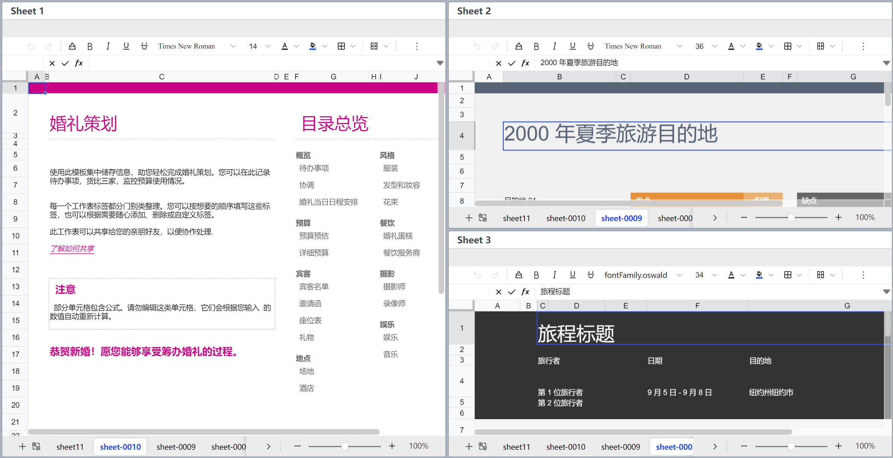
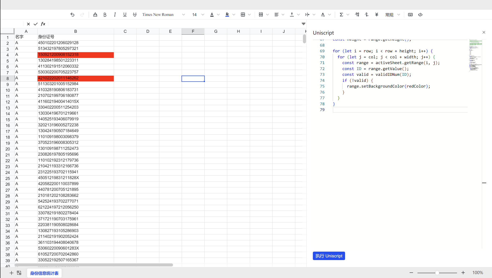

    <picture>
        <source media="(prefers-color-scheme: dark)" srcset="./docs/img/banner-light.png">
        
    </picture>

    
    
    
    
    

    English
    |
    <a href="./README-zh.md">简体中文</a>
    |
    <a href="./README-ja.md">日本語</a>

<!-- An introduction photo here. -->

> 🚧 This project is still in heavy development. Please note that there are likely to be major API changes. Please submit issues and suggestions to us.

## Introduction

Univer is a set of enterprise document and data collaboration solutions, including spreadsheets, documents, and slides. The highly extensible design allows developers to customize personalized functions based on Univer.

Highlights of Univer:

- 📈 Univer supports spreadsheets. Documents and slides will be supported in the future.
- 🌌 Highly extensible architecture design.
  - 🔌 Plug-in architecture, the capabilities of documents can be combined on demand, support third-party plug-ins, and facilitate customization development.
  - 💄 Provide component library and icons to help developers present a consistent user experience.
- ⚡ High performance.
  - ✏️ Unified and efficient rendering engine and formula engine, based on Canvas.
  - 🧮 High-performance formula engine, supports Web Worker.
- 🌍 Internationalization support.

## Examples

| Links | Previews |
| - | - |
| [Multi Instances](https://univer.ai/playground/?title=Multi%20Instance) Run multi Univer instances on the same page |   |
| [Uniscript](https://univer.ai/playground/?title=Uniscript) Use Uniscript to automate your workflow |   |

## Usage

We recommend to import Univer as a npm package. Please checkout the [Quick Start](https://univer.ai/guides/quick-start/) section on the documentation website. We also have an [online playground](https://univer.ai/playground/) which can help you preview Univer without setting up the development environment.

Univer bases on a plugin architecture. You can install the following packages to enhance the functionality of Univer.

### Packages

| Name                                                   | Description                                                                                                                      | Version                                                                                                                               |
| :----------------------------------------------------- | :------------------------------------------------------------------------------------------------------------------------------- | :------------------------------------------------------------------------------------------------------------------------------------ |
| [core](./packages/core)                                | Implements plugin system and architecture of Univer. It also provides basic services and models of different types of documents. |                                |
| [design](./packages/design)                            | Implements the design system on Univer. It provides CSS and a component kit based on React.                                      |                            |
| [docs](./packages/docs)                                | Implements basic logics of rich text editing features. It also facilitates text editing in other types of documents.             |                                |
| [docs-ui](./packages/docs-ui)                          | Provides user interface of Univer Documents                                                                                      |                          |
| [engine-formula](./packages/engine-formula)            | It implements a rendering engine based on Canvas and is extensible for                                                           |            |
| [engine-numfmt](./packages/engine-numfmt)              | It implements a number format engine.                                                                                            |              |
| [engine-render](./packages/engine-render)              | It implements a rendering engine based on canvas context2d.                                                                      |              |
| [facade](./packages/facade)                            | It serves as an API layer to make it easier to use Univer                                                                        |                            |
| [find-replace](./packages/find-replace)                | It implements find and replace features in Univer.                                                                               |                |
| [network](./packages/network)                          | It implements network services based on WebSocket and HTTP.                                                                      |                          |
| [rpc](./packages/rpc)                                  | It implements a RPC mechanism and methods to sync data between different replicas of Univer documents.                           |                                  |
| [sheets](./packages/sheets)                            | Basic logics of spreadsheet features.                                                                                            |                            |
| [sheets-find-replace](./packages/sheets-find-replace)  | It implements find and replace features in Univer Spreadsheets.                                                                  |  |
| [sheets-formula](./packages/sheets-formula)            | It implements formula in spreadsheets.                                                                                           |            |
| [sheets-numfmt](./packages/sheets-numfmt)              | It implements number format in spreadsheets.                                                                                     |              |
| [sheets-zen-editor](./packages/sheets-zen-editor)      | It implements Zen editing mode in spreadsheets.                                                                                  |      |
| [sheets-ui](./packages/sheets-ui)                      | Provides user interface of Univer Spreadsheets                                                                                   |                      |
| [ui](./packages/ui)                                    | Implements basic user interactions with Univer and workbench layout based on React.                                              |                                    |
| [uniscript](./packages/uniscript) (experimental)       | Implements a DSL based on Typescript that empowers users to accomplish more sophisticated tasks                                  |                      |

## Contribution

We appreciate any kinds of contributing. You can submit [issues or feature requests](https://github.com/dream-num/univer/issues) to us. Please read our [contributing guide](./CONTRIBUTING.md) first.

If you would like to contribute code to Univer, please refer to the contributing guide as well. It would guide you through the process of setting up the development environment and submitting a pull request.

## Sponsors

The growth and development of the Univer project rely on the support of its backers and sponsors. If you are interested in supporting our project, we kindly invite you to consider becoming a sponsor. You can sponsor us through [Open Collective](https://opencollective.com/univer).

Thanks to our sponsors, just part of them are listed here because of the space limit, ranking is no particular order:

## Stargazers

## Links

- [Documentation](https://univer.ai/guides/introduction/)
- [Online Playground](https://univer.ai/playground/)
- [Official Website](https://univer.ai)

### Community

- [Discord community](https://discord.gg/z3NKNT6D2f)

## License

Univer is distributed under the terms of the Apache-2.0 license.

---

Copyright DreamNum Inc. 2023-present
