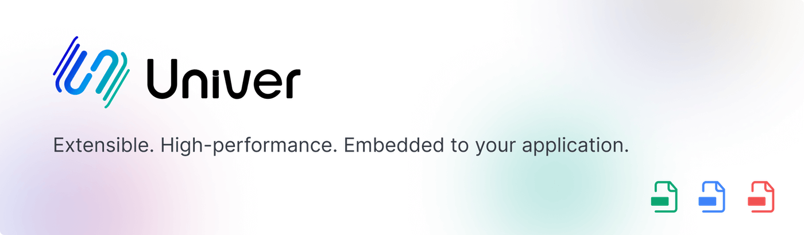

<picture>
    <source media="(prefers-color-scheme: dark)" srcset="./docs/img/banner-light.png">
    
</picture>

An Isomorphic Full-Stack Framework for Creating and Editing Spreadsheets, Docs, and Slides Across Web and Server. 
**Extensible. High-performance. Embedded to your application.**

**English** | [简体中文][readme-zh-link] | [日本語][readme-ja-link] | [Español][readme-es-link]  
[Official Site][official-site-link] | [Documentation][documentation-link] | [Online Playground][playground-link] | [Blog][blog-link]

[![][github-license-shield]][github-license-link]
[![][github-actions-shield]][github-actions-link]
[![][github-stars-shield]][github-stars-link]
[![][github-contributors-shield]][github-contributors-link]  
[![][github-forks-shield]][github-forks-link]
[![][github-issues-shield]][github-issues-link]
[![][codecov-shield]][codecov-link]
[![][codefactor-shield]][codefactor-link]
[![][discord-shield]][discord-link]

[![Trendshift][github-trending-shield]][github-trending-url]

## Use Univer MCP to drive Univer Spreadsheets with natural language and build AI-native spreadsheets.

https://github.com/user-attachments/assets/7429bd5f-d769-4057-9e67-353337531024

<strong>Table of contents</strong>

- [🌈 Highlights](#-highlights)
- [✨ Features](#-features)
    - [📊 Univer Sheet](#-univer-sheet)
    - [📝 Univer Doc](#-univer-doc-under-development)
    - [📽️ Univer Slide](#%EF%B8%8F-univer-slide-under-development)
- [🌐 Internationalization](#-internationalization)
- [👾 Showcase](#-showcase)<!-- - [📦 Ecosystem](#-ecosystem) -->
- [💬 Community](#-community)
- [🤝 Contribution](#-contribution)
- [❤️ Sponsor](#%EF%B8%8F-sponsors)
- [📄 License](#-license)

## 🌈 Highlights

- 📈 Univer is designed to support **spreadsheets**, **documents** and **presentation**.
- 🧙‍♀️ Univer is **isomorphic**. It can run both on browsers and Node.js (in the future, mobile devices as well), with the same API.
- ⚙️ Univer is easily **embeddable**, allowing seamless integration into your applications.
- 🎇 Univer is **powerful**, offering a wide range of features including **formulas**, **conditional formatting**, **data validation**, **filtering**, **collaborative editing**, **printing**, **import & export** and more features on the horizon.
- 🔌 Univer is **highly extensible**, thanks to its *plug-in architecture* that makes it a delight for developers to implement their unique requirements on the top of Univer.
- 💄 Univer is **highly customizable**, allowing you to personalize its appearance using *themes*. It also provides support for internationalization (i18n).
- 🥤 Univer is **easy to work with**. The *Presets* & *Facade API* make it easy to hands on.
- ⚡ Univer in **performant**.
  - ✏️ Univer boasts an efficient *rendering engine* based on canvas, capable of rendering various document types flawlessly. The rendering engines supports advanced typesetting features such as *punctuation squeezing*, *text and image layout* and *scroll buffering*.
  - 🧮 Univer incorporates a lightning-fast *formula engine* that can operate in Web Workers or even on the server side.
- 🌌 Univer is a **highly integrated** system. Documents, spreadsheets and slides can interoperate with each others and even rendered on the same canvas, allowing information and data flow within Univer.

## ✨ Features

Univer provides a wide range of features for spreadsheets, documents and presentations. Here are some of the key features:

### 📊 Univer Sheets

- **Core Features**: Univer supports core spreadsheet functionality, including cells, rows, columns, worksheets, and workbooks.
- **Formulas**: Extensive support for various formulas, including mathematical, statistical, logical, text, date and time, lookup and reference, engineering, financial, and information formulas.
- **Permissions**: Allows restricting access to specific elements.
- **Number Formatting**: Supports formatting numbers based on specific criteria.
- **Hyperlinks**: Enables linking to external websites, email addresses, and other locations within a spreadsheet.
- **Floating Images**: Allows inserting images into a spreadsheet and positioning them anywhere on the sheet.
- **Find & Replace**: Provides the ability to search for specific text within a spreadsheet and replace it with other text.
- **Filtering**: Allows filtering data based on specific criteria.
- **Sorting**: Allows sorting data based on specific criteria.
- **Data Validation**: Supports restricting the type of data that can be entered into a cell.
- **Conditional Formatting**: Supports applying formatting to cells based on specific criteria.
- **Comments**: Enables adding comments to cells to provide additional information.
- **Cross-highlighting**: Supports displaying cross-highlighting in spreadsheets to help users quickly locate selected cells.
- **Zen Editor**: Provides a distraction-free editing experience with a clean interface and minimal distractions.
- **Pivot Tables**[^1]: Supports pivot tables, allowing users to summarize and analyze data.
- **Sparklines**[^1]: Supports sparklines, which are small charts that fit within a cell to provide a visual representation of data.
- **Printing**[^1]: Allows printing a spreadsheet or exporting it to PDF.
- **Import & Export**[^1]: Support for importing and exporting data in XLSX.
- **Charts**[^1]: Supports various types of charts, including bar charts, line charts, pie charts, scatter plots, and more.
- **Collaborative Editing**[^1]: Supports multiple users editing a spreadsheet simultaneously. File history and recovering are also provided.
- **Editing History**[^1]: Allows users to view and restore previous versions of a spreadsheet.

### 📝 Univer Docs (rc)

- **Core Features**: Univer supports core document features, including paragraphs, headings, lists, superscript, subscript, and more.
- **Lists**: Supports ordered lists, unordered lists, and task lists.
- **Hyperlinks**: Supports inserting links to external websites, email addresses, and other locations within a document.
- **Floating Images**: Allows inserting images into a document and supporting text and image layout.
- **Headers & Footers**: Allows adding headers and footers to a document.
- **Comments**: Enables adding comments to a document to provide additional information.
- **Printing**[^1]: Allows printing a document or exporting it to PDF.
- **Import & Export**[^1]: Supports importing and exporting data in DOCX format.
- **Collaborative Editing**[^1]: Supports multiple users editing a document simultaneously.

### 📽️ Univer Slides (Under Development)

- **Core Features**: Univer will support core presentation features, including slides, shapes, text, images, and more.

## 🌐 Internationalization

Univer supports multiple languages, including:

- `zh-CN`
- `zh-TW`
- `en-US`
- `ru-RU`
- `vi-VN`
- `fa-IR`
- `ko-KR`
- `es-ES`
- `ca-ES`

`zh-CN` and `en-US` are officially supported, while the others are contributed and maintained by the community.

You can add the language you want by [Using Custom Locales](https://univer.ai/guides/sheet/getting-started/i18n#using-custom-locales). You can also help us add new language support by referring to the [contribution guide](./CONTRIBUTING.md).

## 👾 Showcase

Embed Univer in AI products as a data presentation tool.

[![][examples-preview-capalyze]][examples-link-capalyze]

You can find all the examples in the [Univer Examples](https://univer.ai/examples).

| **📊 Spreadsheets** | **📊 Multi-instance** | **📊 Uniscript** |
| :---: | :---: | :---: |
| [![][examples-preview-0]][examples-link-0] | [![][examples-preview-1]][examples-link-1] | [![][examples-preview-2]][examples-link-2] |
| **📊 Big data** | **📊 Collaboration** | **📊 Collaboration Playground** |
| [![][examples-preview-3]][examples-link-3] | [![][examples-preview-4]][examples-link-4] | [![][examples-preview-5]][examples-link-5] |
| **📊 Import & Export** | **📊 Printing** | **📝 Documents** |
| [![][examples-preview-6]][examples-link-6] | [![][examples-preview-7]][examples-link-7] | [![][examples-preview-8]][examples-link-8] |
| **📝 Multi-instance** | **📝 Uniscript** | **📝 Big data** |
| [![][examples-preview-9]][examples-link-9] | [![][examples-preview-10]][examples-link-10] | [![][examples-preview-11]][examples-link-11] |
| **📝 Collaboration** | **📝 Collaboration Playground** | **📽️ Presentations** |
| [![][examples-preview-12]][examples-link-12] | [![][examples-preview-13]][examples-link-13] | [![][examples-preview-14]][examples-link-14] |
| **📊 Zen Editor** | **Univer Workspace (SaaS version)** | &nbsp; |
| [![][examples-preview-15]][examples-link-15] | [![][examples-preview-16]][examples-link-16] | &nbsp; |

<!-- ## 📦 Ecosystem

Univer has a rich ecosystem that includes a wide range of tools and resources to help you get started with Univer: -->

## 🔗 Links

- [Latest Preview of the `dev` Branch](https://univer-preview.vercel.app/)
- [Official Site](https://univer.ai)
- [Presets Repository](https://github.com/dream-num/univer-presets)

## 🔒 Security

Univer is committed to maintaining a secure codebase. We follow best practices for security and regularly update our dependencies. For more information, please refer to our [Security Policy](./SECURITY.md).

## 💬 Community

[![][github-community-badge]][github-community-link] [![][discord-community-badge]][discord-community-link] [![][stackoverflow-community-badge]][stackoverflow-community-link]

Univer is an inclusive and welcoming project. Please read our [Code of Conduct](./CODE_OF_CONDUCT.md) before participating in the community.

Join the Univer community:

- Chat with us and other developers on [Discord][discord-community-link].
- Start a discussion on [GitHub Discussions][github-community-link].
- Open a topic on [Stack Overflow][stackoverflow-community-link] and tag it with `univer`.

You can also find Univer on:

[Twitter][twitter-community-link] | [YouTube][youtube-community-link]

## 🤝 Contribution

We appreciate any kinds of contributing. You can submit [issues or feature requests](https://github.com/dream-num/univer/issues) to us. Please read our [contributing guide](./CONTRIBUTING.md) first.

If you would like to contribute code to Univer, please refer to the contributing guide as well. It would guide you through the process of setting up the development environment and submitting a pull request.

## ❤️ Sponsors

The growth and development of the Univer project rely on the support of its backers and sponsors. If you are interested in supporting our project, we kindly invite you to consider becoming a sponsor. You can sponsor us through [Open Collective](https://opencollective.com/univer).

Thanks to our sponsors, just part of them are listed here because of the space limit, ranking is no particular order:

[![][sponsor-badge-0]][sponsor-link-0]
[![][sponsor-badge-1]][sponsor-link-1]
[![][sponsor-badge-2]][sponsor-link-2]
[![][sponsor-badge-3]][sponsor-link-3]
[![][sponsor-badge-4]][sponsor-link-4]
[![][sponsor-badge-5]][sponsor-link-5]
[![][sponsor-badge-6]][sponsor-link-6]

[![][backer-badge-0]][backer-link-0]
[![][backer-badge-1]][backer-link-1]
[![][backer-badge-2]][backer-link-2]
[![][backer-badge-3]][backer-link-3]
[![][backer-badge-4]][backer-link-4]
[![][backer-badge-5]][backer-link-5]
[![][backer-badge-6]][backer-link-6]

## 📄 License

Copyright © 2021-2025 DreamNum Co,Ltd. All Rights Reserved.

Licensed under the [Apache-2.0](https://www.apache.org/licenses/LICENSE-2.0) license.

<!-- Footnotes -->
[^1]: These features are provided by the non-OSS version of Univer, which is free for commercial use and also includes paid upgrade plans.

<!-- Links -->
[github-license-shield]: https://img.shields.io/github/license/dream-num/univer?style=flat-square
[github-license-link]: ./LICENSE
[github-actions-shield]: https://img.shields.io/github/actions/workflow/status/dream-num/univer/build.yml?style=flat-square
[github-actions-link]: https://github.com/dream-num/univer/actions/workflows/build.yml
[github-stars-link]: https://github.com/dream-num/univer/stargazers
[github-stars-shield]: https://img.shields.io/github/stars/dream-num/univer?style=flat-square
[github-trending-shield]: https://trendshift.io/api/badge/repositories/4376
[github-trending-url]: https://trendshift.io/repositories/4376
[github-contributors-link]: https://github.com/dream-num/univer/graphs/contributors
[github-contributors-shield]: https://img.shields.io/github/contributors/dream-num/univer?style=flat-square
[github-forks-link]: https://github.com/dream-num/univer/network/members
[github-forks-shield]: https://img.shields.io/github/forks/dream-num/univer?style=flat-square
[github-issues-link]: https://github.com/dream-num/univer/issues
[github-issues-shield]: https://img.shields.io/github/issues/dream-num/univer?style=flat-square
[codecov-shield]: https://img.shields.io/codecov/c/gh/dream-num/univer?token=aPfyW2pIMN&style=flat-square
[codecov-link]: https://codecov.io/gh/dream-num/univer
[codefactor-shield]: https://www.codefactor.io/repository/github/dream-num/univer/badge/dev?style=flat-square
[codefactor-link]: https://www.codefactor.io/repository/github/dream-num/univer/overview/dev
[discord-shield]: https://img.shields.io/discord/1136129819961217077?logo=discord&logoColor=FFFFFF&label=discord&color=5865F2&style=flat-square
[discord-link]: https://discord.gg/z3NKNT6D2f

[readme-en-link]: ./README.md
[readme-zh-link]: ./README-zh.md
[readme-ja-link]: ./README-ja.md
[readme-es-link]: ./README-es.md

[official-site-link]: https://univer.ai
[documentation-link]: https://docs.univer.ai/en-US
[playground-link]: https://docs.univer.ai/en-US/showcase
[blog-link]: https://docs.univer.ai/en-US/blog

[stackoverflow-community-link]: https://stackoverflow.com/questions/tagged/univer
[stackoverflow-community-badge]: https://img.shields.io/badge/stackoverflow-univer-ef8236?labelColor=black&logo=stackoverflow&logoColor=white&style=for-the-badge
[github-community-link]: https://github.com/dream-num/univer/discussions
[github-community-badge]: https://img.shields.io/badge/github-univer-24292e?labelColor=black&logo=github&logoColor=white&style=for-the-badge
[discord-community-link]: https://discord.gg/z3NKNT6D2f
[discord-community-badge]: https://img.shields.io/discord/1136129819961217077?color=5865F2&label=discord&labelColor=black&logo=discord&logoColor=white&style=for-the-badge
[twitter-community-link]: https://twitter.com/univerhq
[youtube-community-link]: https://www.youtube.com/@dreamNum
[zhihu-community-link]: https://www.zhihu.com/org/meng-shu-ke-ji
[segmentfault-community-link]: https://segmentfault.com/u/congrongdehongjinyu
[juejin-community-link]: https://juejin.cn/user/4312146127850733

[sponsor-link-0]: https://opencollective.com/univer/sponsor/0/website
[sponsor-link-1]: https://opencollective.com/univer/sponsor/1/website
[sponsor-link-2]: https://opencollective.com/univer/sponsor/2/website
[sponsor-link-3]: https://opencollective.com/univer/sponsor/3/website
[sponsor-link-4]: https://opencollective.com/univer/sponsor/4/website
[sponsor-link-5]: https://opencollective.com/univer/sponsor/5/website
[sponsor-link-6]: https://opencollective.com/univer/sponsor/6/website
[sponsor-badge-0]: https://opencollective.com/univer/sponsor/0/avatar.svg
[sponsor-badge-1]: https://opencollective.com/univer/sponsor/1/avatar.svg
[sponsor-badge-2]: https://opencollective.com/univer/sponsor/2/avatar.svg
[sponsor-badge-3]: https://opencollective.com/univer/sponsor/3/avatar.svg
[sponsor-badge-4]: https://opencollective.com/univer/sponsor/4/avatar.svg
[sponsor-badge-5]: https://opencollective.com/univer/sponsor/5/avatar.svg
[sponsor-badge-6]: https://opencollective.com/univer/sponsor/6/avatar.svg
[backer-link-0]: https://opencollective.com/univer/backer/0/website
[backer-link-1]: https://opencollective.com/univer/backer/1/website
[backer-link-2]: https://opencollective.com/univer/backer/2/website
[backer-link-3]: https://opencollective.com/univer/backer/3/website
[backer-link-4]: https://opencollective.com/univer/backer/4/website
[backer-link-5]: https://opencollective.com/univer/backer/5/website
[backer-link-6]: https://opencollective.com/univer/backer/6/website
[backer-badge-0]: https://opencollective.com/univer/backer/0/avatar.svg
[backer-badge-1]: https://opencollective.com/univer/backer/1/avatar.svg
[backer-badge-2]: https://opencollective.com/univer/backer/2/avatar.svg
[backer-badge-3]: https://opencollective.com/univer/backer/3/avatar.svg
[backer-badge-4]: https://opencollective.com/univer/backer/4/avatar.svg
[backer-badge-5]: https://opencollective.com/univer/backer/5/avatar.svg
[backer-badge-6]: https://opencollective.com/univer/backer/6/avatar.svg

[examples-preview-capalyze]: ./docs/img/examples-sheets-capalyze.gif
[examples-preview-0]: ./docs/img/examples-sheets.gif
[examples-preview-1]: ./docs/img/examples-sheets-multi.gif
[examples-preview-2]: ./docs/img/examples-sheets-uniscript.gif
[examples-preview-3]: ./docs/img/examples-sheets-big-data.gif
[examples-preview-4]: ./docs/img/pro-examples-sheets-collaboration.gif
[examples-preview-5]: ./docs/img/pro-examples-sheets-collaboration-playground.gif
[examples-preview-6]: ./docs/img/pro-examples-sheets-exchange.gif
[examples-preview-7]: ./docs/img/pro-examples-sheets-print.gif
[examples-preview-8]: ./docs/img/examples-docs.gif
[examples-preview-9]: ./docs/img/examples-docs-multi.gif
[examples-preview-10]: ./docs/img/examples-docs-uniscript.gif
[examples-preview-11]: ./docs/img/examples-docs-big-data.gif
[examples-preview-12]: ./docs/img/pro-examples-docs-collaboration.gif
[examples-preview-13]: ./docs/img/pro-examples-docs-collaboration-playground.gif
[examples-preview-14]: ./docs/img/examples-slides.gif
[examples-preview-15]: ./docs/img/zen-mode.gif
[examples-preview-16]: ./docs/img/univer-workspace-drag-chart.gif
[examples-link-capalyze]: https://capalyze.ai/
[examples-link-0]: https://docs.univer.ai/showcase
[examples-link-1]: https://docs.univer.ai/showcase
[examples-link-2]: https://docs.univer.ai/showcase
[examples-link-3]: https://docs.univer.ai/showcase
[examples-link-4]: https://docs.univer.ai/showcase
[examples-link-5]: https://docs.univer.ai/showcase
[examples-link-6]: https://docs.univer.ai/showcase
[examples-link-7]: https://docs.univer.ai/showcase
[examples-link-8]: https://docs.univer.ai/showcase
[examples-link-9]: https://docs.univer.ai/showcase
[examples-link-10]: https://docs.univer.ai/showcase
[examples-link-11]: https://docs.univer.ai/showcase
[examples-link-12]: https://docs.univer.ai/showcase
[examples-link-13]: https://docs.univer.ai/showcase
[examples-link-14]: https://docs.univer.ai/showcase
[examples-link-15]: https://univer.ai/guides/sheet/features/zen-editor
[examples-link-16]: https://youtu.be/kpV0MvQuFZA
