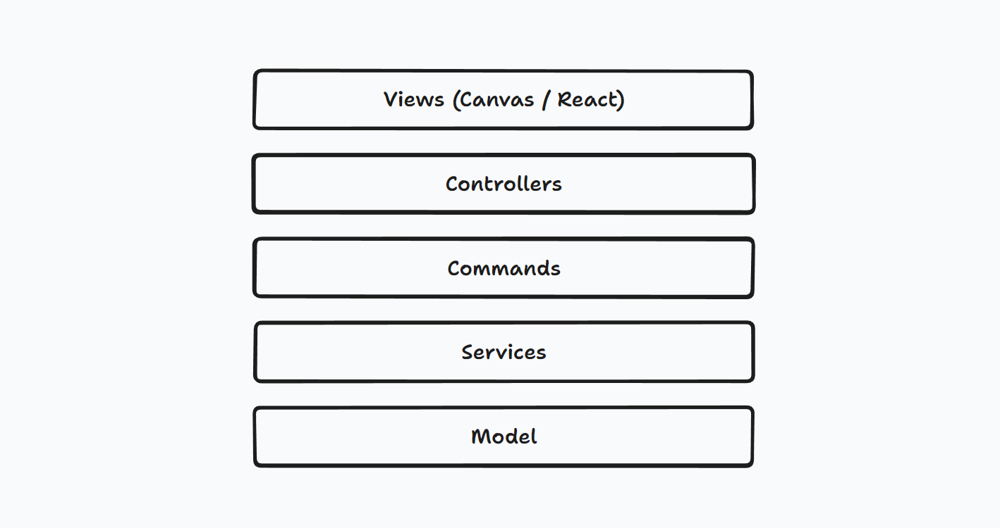

# Architecture Notes 架构概要

## Univer 架构设计的核心需求

这些设计的需求部分来自于 Univer 的产品规划，部分来自于团队成员参与别的项目研发所得到的 learning

1. **100% 拥抱 web 技术栈**。Univer 需要运行在相当多的环境里，要满足快速的迭代需求并让客户、ISV、社区有二次开发的能力，能同时满足这些需求的只有以 web 技术为核心的技术栈。
2. **插件化和高度可扩展性**。Univer 的各个模块应当尽可能地以插件的方式存在，尽可能解耦插件之间的耦合关系，做到降低适配不同的用户需求、不同的运行环境的成本，同时降低二次开发的门槛。
3. **层次结构和单向依赖**。Univer 的模块之间不允许循环依赖，这使得我们可以按照不同环境的需要加载所需的层次和模块。
4. **面向多平台做设计**。解耦代码和具体运行环境的耦合关系，方便迁移到不同的运行环境当中。
5. **面向高可测试性做设计**。各个模块直接尽可能基于接口建立依赖关系，方便独立测试。

## 插件和依赖注入


### 插件

Univer 的模块需按照 **业务类型（Sheet / Doc / Slide）、关注面（配置管理 / UI / 快捷键 / canvas 渲染）、功能（Sheet 基本操作 / Sheet 条件格式 / Sheet 筛选、运行环境（桌面端 / 移动端 / Node.js 等）** 等因素综合考虑，拆分成各个插件（plugin），组合成为一个 Univer 应用。

基于插件的设计能够使得 Univer 能够满足多样的运行环境（PC browser / Node / 移动端）、不同的功能需求、不同的配置要求、二次开发、三方插件等需要。

典型的插件及扩展能力可以参考文档 [Plugin 扩展能力](https://github.com/dream-num/univer/wiki/%5BWIP%5D-Plugin-%E6%89%A9%E5%B1%95%E8%83%BD%E5%8A%9B)。

### 依赖注入

插件内部可以根据实际需要将代码划分为下面 “层次结构” 一节中介绍的各个层次的模块，这些模块中的 service 和 controller 需要加入 Univer 的依赖注入系统，这样 Univer 就能自动解析这些模块之间的依赖关系并实例化这些模块。依赖注入系统的文档参考 [redi - redi](https://redi.wendell.fun/zh-CN)。

### 插件的公有私有模块

可以通过在每个插件的 index.ts 文件中导出这些模块的依赖注入标识符 identifier。如果一个模块的 identifier 被导出，那么其它的插件就可以 import 这些模块的 identifier，从而建立对这些模块的依赖关系，这些模块也就成为前一个插件的公有模块，反之就是私有模块。如果你熟悉 Angular 的话，很容易发现这跟 NgModule 的概念非常相似，只不过我们不用申明 exports 字段，而是用 es module 的 export 来区分公有模块。

### 插件生命周期

插件有如下四个生命周期

```ts
export const enum LifecycleStages {
    Starting,
    Ready,
    Rendered,
    Steady,
}
```

* `Starting` plugin 挂载到 Univer 实例上的第一个生命周期，此时 Univer 业务实例尚未被创建。Plugin 在此生命周期中应该将自己模块加入到依赖注入系统当中。不建议在此生命周期之外初始化插件内部模块。
* `Ready` Univer 的第一个业务实例已经创建，plugin 可以在此生命周期做大部分初始化工作。
* `Rendered` 第一次渲染已经完成，plugin 可以在此生命周期进行需要依赖 DOM 的初始化工作。
* `Steady` 在 `Rendered` 一段时间之后触发，plugin 可以在此生命周期进行非首屏必须得工作，以提升加载性能。

对应的，Plugin 类型上有四个生命周期勾子

```ts
/**
 * Plug-in base class, all plug-ins must inherit from this base class. Provide basic methods.
 */
export abstract class Plugin {
    onStarting(_injector: Injector): void {}

    onReady(): void {}

    onRendered(): void {}

    onSteady(): void {}
}
```

除了这四个生命周期勾子之外，插件内部的模块可以使用 `OnLifecycle` 装饰器声明自己需要在特定的生命周期阶段初始化，例如

```ts
@OnLifecycle(LifecycleStages.Rendered, IMEInputController)
export class IMEInputController extends Disposable {}
```

另外也可以通过注入 `LifecycleService` 来监听生命周期事件。

```ts
export class YourService {
    constructor(
        @Inject(LifecycleService) private _lifecycleService: LifecycleService,
    ) {
        super();

        this._lifecycleService.lifecycle$.subscribe((stage) => this._initModulesOnStage(stage));
    }
}
```

### 划分插件的依据

插件的划分主要的依据是：在某些场景下，一些模块是否需要不需要加载。例如在 Node.js 端运行时，可能不需要加载 UI 相关的模块，这样就可以将 UI 相关的模块放在一个插件中，然后在 Node.js 端不加载这个插件；又例如想让用户自行选择是否加载一个功能，那么就可以将这个功能放在一个插件中。

## 层次结构



插件内部的模块基本应当归属于以下层次：

* View 处理渲染和交互，包括 canvas 渲染和 React 组件
* Controller 封装业务逻辑（特别是功能逻辑），派发 Command 等
* Command 通过命令模式执行逻辑，修改下面 Service / Model 等层次的状态或数据
* Service 按照关注点封装功能给上层模块使用，存储应用内部状态，操作底层数据等等
* Model 存储业务数据

层次之间需要保持单向依赖关系，除部分 Controller 作为 MVVM 中的 view-model 之外可能持有对 UI 层对象的引用，其他层次禁止引用上层模块的代码。

注意：插件的代码并非只能属于一个层次，例如一个插件可能同时提供 View 和 Controller。

## 命令系统 Command

对应用状态和数据的变更需要通过命令系统执行。Univer core 中提供了命令服务，其依赖注入 token 为 `ICommandService`。上层模块可以将业务逻辑封装在 Command 里，并通过命令系统获取到其他 services 从而执行业务逻辑。基于命令系统，Univer 可以通过简单的方式实现协同编辑、宏录制、撤销重做、跟随浏览等能力。

plugin 可以通过 `ICommandService` 提供的 `registerCommand` 接口注册命令，并通过 `executeCommand` 接口执行命令：

```ts
export interface ICommand<P extends object = object, R = boolean> {
    /**
     * ${businessName}.${type}.${name}
     */
    readonly id: string;
    readonly type: CommandType;

    handler(accessor: IAccessor, params?: P): Promise<R>;

    /** When this command is unregistered, this function would be called. */
    onDispose?: () => void;
}

export interface ICommandService {
    registerCommand(command: ICommand): IDisposable;

    executeCommand<P extends object = object, R = boolean>(
        id: string,
        params?: P,
        options?: IExecutionOptions
    ): Promise<R> | R;
}
```

`Command` 一共有三种类型

```ts
export const enum CommandType {
    /** Command could generate some operations or mutations. */
    COMMAND = 0,
    /** An operation that do not require conflict resolve.  */
    OPERATION = 1,
    /** An operation that need to be resolved before applied on peer client. */
    MUTATION = 2,
}
```

* `COMMAND` 负责根据特定的业务逻辑创建、编排和执行 `MUTATION` 或 `OPERATION`，例如一个 **删除行 `COMMAND`** 会生成一个 **删除行 `MUTATION`** 和用于 undo 的一个 **插入行 `MUTATION`** 及一个 **设置单元格内容 `MUTATION`**
  * `COMMAND` 是业务逻辑的主要承载者，如果对于一个 _用户操作行为_ 需要根据应用的状态来触发不同的 _底层行为_ —— 例如 _用户点击加粗文字按钮_ 时 需要根据当前选区范围来决定 _加粗操作的生效范围_ —— 相应的判断应该由 `COMMAND` 完成
  * 可以派发其他 `COMMAND` `OPERATION` `MUTATION`
* `MUTATION` 是对落盘数据所做的变更，涉及协同编辑的冲突处理，例如插入行列，修改单元格内容，修改筛选范围等等操作
  * 不可以再派发其他任何命令
* `OPERATION` 是对不落盘数据（或称应用状态）所做的变更，不涉及冲突处理，例如修改滚动位置、修改侧边栏状态等等
  * 不可以再派发其他任何命令

### 协同编辑

`ICommandService` 提供事件监听接口，插件可监听哪些命令被执行了，以及执行的参数是什么。实际上，命令执行后会派发这样一个事件：

```ts
/**
 * The command info, only a command id and responsible params
 */
export interface ICommandInfo<T extends object = object> {
    id: string;

    type: CommandType;

    /**
     * Args should be serializable.
     */
    params?: T;
}
```

对于协同编辑而言 collaboration-plugin 可以监听所有 `MUTATION` 类型命令，并通过协同编辑算法将 `MUTATION` 发送到其他协同端，再通过 `ICommandService` 重新执行这些 `MUTATION`。

### 操作录制和回放

通过监听 `OPERATION` 和 `MUTATION` 的执行，插件可以将用户的操作行为记录下来，并且可以在此基础上实现：

* 协同光标
* 类似于飞书视频的 Magic Share
* 宏录制
* AppScript

等等。

## 交互

Univer 提供了一些机制简化 UI 的开发，降低菜单、快捷键等在不同的设备以及交互组件内的工作量。功能插件无需关心 UI 上的细节，只需要专注于业务逻辑即可。

### ShortcutService

通过向 `IShortcutService` 注入 `IShortcutItem` 可以注册一个快捷键，并且配置它的键位、优先级、触发条件、执行的 Command 等。

```ts
export interface IShortcutItem<P extends object = object> {
    /** This should reuse the corresponding command's id. */
    id: string;
    description?: string;

    priority?: number;
    /** A callback that will be triggered to examine if the shortcut should be invoked. */
    preconditions?: (contextService: IContextService) => boolean;

    /** A command can be bound to several bindings, with different static parameters perhaps. */
    binding: number;
    mac?: number;
    win?: number;
    linux?: number;

    /** Static parameters of this shortcut. Would be send to `CommandService.executeCommand`. */
    staticParameters?: P;
}

export interface IShortcutService {
    registerShortcut(shortcut: IShortcutItem): IDisposable;

    getCommandShortcut(id: string): string | null;
}
```

### MenuService

通过向 `IMenuService` 注册 `IMenuItem` 可以配置一个菜单项。

```ts
interface IMenuItemBase<V> {
    /** ID of the menu item. Normally it should be the same as the ID of the command that it would invoke.  */
    id: string;
    title: string;
    description?: string;
    icon?: string;
    tooltip?: string;

    /** In what menu should the item display. */
    positions: OneOrMany<MenuPosition | string>;

    /** @deprecated this type seems unnecessary */
    type: MenuItemType;
    /** Determines how the label of the selector should display. */
    display?: DisplayTypes;
    /**
     * Custom label component id.
     * */
    label?:
        | string
        | {
              name: string;
              props?: Record<string, string | number>;
          };

    hidden$?: Observable<boolean>;
    disabled$?: Observable<boolean>;

    /** On observable value that should emit the value of the corresponding selection component. */
    value$?: Observable<V>;
    onClose?: () => void;
}

export interface IMenuService {
    menuChanged$: Observable<void>;

    addMenuItem(item: IMenuItem): IDisposable;

    /** Get menu items for display at a given position or a submenu. */
    getMenuItems(position: MenuPosition | string): Array<IDisplayMenuItem<IMenuItem>>;
    getMenuItem(id: string): IMenuItem | null;
}
```

## 编写可维护和可扩展的代码一些基本原则

* **注意 接口 的设计的概念完整性和简洁**
  * 模块的接口尽可能小，最理想的情况是在小的接口后面封装大量复杂度
  * 不要将外部传入的依赖再导出一次
  * 透传是个不好的信号，说明接口可能不正确
  * 变量的命名要保持一致
  * 尽可能地使用接口来定义模块之间的依赖关系，这样可以使得模块之间的耦合度降低，方便测试和扩展
* **注意通过 反转 来确定可扩展的耦合关系**
  * 通过事件、回调来实现反转（依赖的方向和代码控制流的方向的反转）
  * 避免 know-it-all 的模块，避免一个模块知道大量的业务细节
* **注意代码的 可读性**
  * 可读性不是格式化
  * 可读性是代码意图的表达，一眼就能让别人明白你的代码想要做什么的代码就是好代码
    * 通过名字来表达意图
      * 通过合理的命名来表达意图
      * 通过抽离函数来表达意图
      * 通过抽离变量来表达意图（magic number）
    * 通过空行来表达意图，比如处理函数参数的代码之间不空行，参数处理代码和主体逻辑之间空一行，意图由代码之间的距离所体现
    * 通过注释来表达意图
* **没有银弹**
  * 没有按部就班的步骤能够保证代码一定是好理解可维护的
  * code review ，见到看不懂的代码及时清理和增加注释，甚至是单元测试
