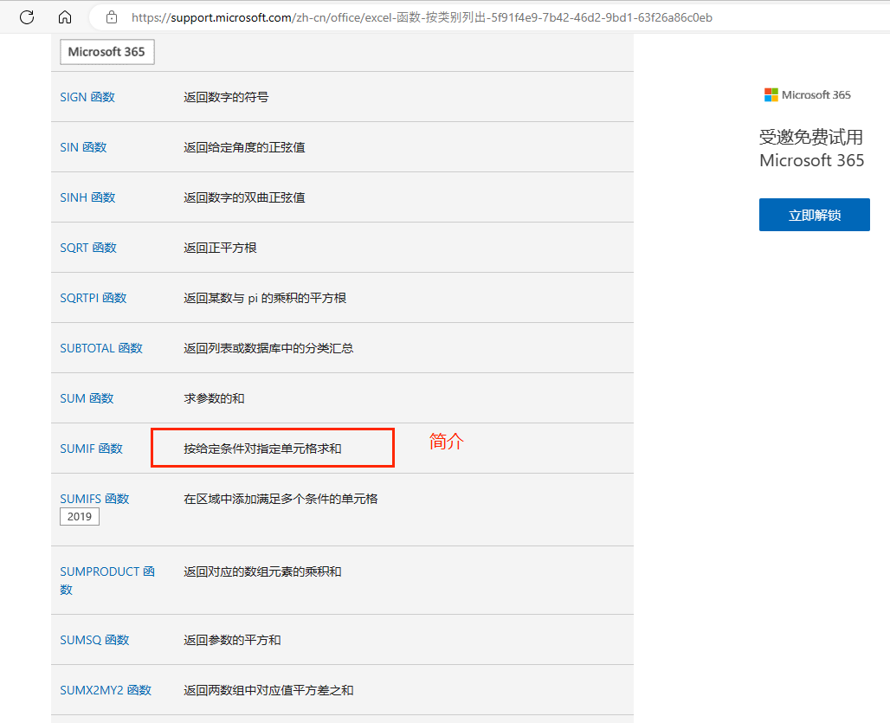
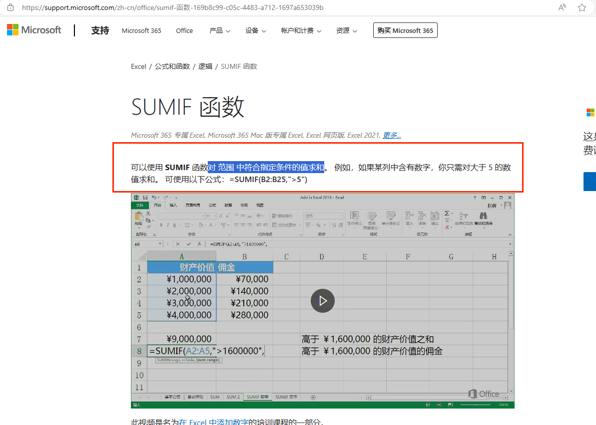
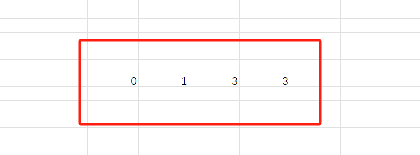
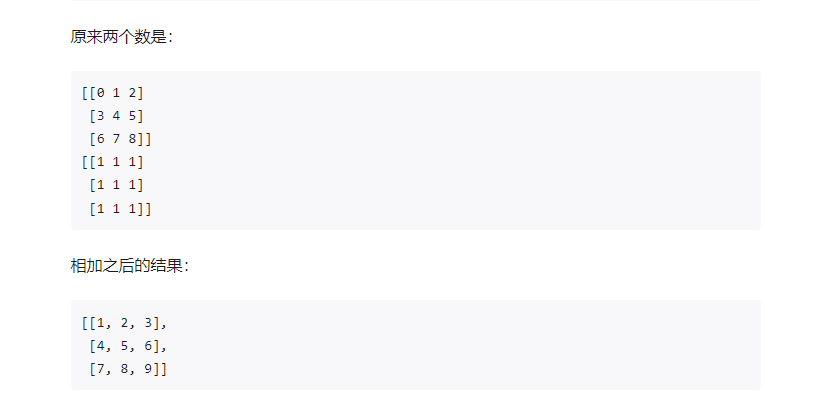

# @univerjs/sheets-formula

[](https://npmjs.org/package/@univerjs/sheets-formula)
[](https://img.shields.io/npm/l/@univerjs/sheets-formula)


## 简介

`@univerjs/sheets-formula` 提供了在电子表格中编辑公式的能力，例如自动补全、公式提示、公式的下拉填充以及复制粘贴等等。

:::note
公式计算是电子表格的核心功能之一，因此公式计算调度是在 `@univerjs/sheets` 中进行的。
:::

## 使用指南

### 安装

```shell
# 使用 npm
npm install @univerjs/sheets-formula

# 使用 pnpm
pnpm add @univerjs/sheets-formula
```

### 添加公式前置条件

如果官方提供的公式不满足您的需求，可以自己扩展公式。根据不同的需求，我们提供了多种方式来支持注册一个或多个自定义公式。

您需要先准备好公式提示所需要的国际化文案和算法，然后参考我们的[贡献指南](https://github.com/dream-num/univer/blob/dev/CONTRIBUTING.md)运行 Univer 项目，再开始添加公式。

### 如何使用 Uniscript 添加公式

使用 Uniscript 脚本，可以方便快速的在当前 Univer 实例中注册自定义公式。

如下案例所示，使用 `registerFunction` 将一个 `CUSTOMSUM` 公式所需要的算法、名称、描述一次性注册到公式插件，执行之后就可以使用公式了。在任一空白单元格输入 `=CUSTOMSUM` 可以看到提示。

```js
univerAPI.registerFunction({
    calculate: [
        [function (...variants) {
            let sum = 0;

            for(const variant of variants){
                sum += Number(variant) || 0;
            }

            return sum;
        }, 'CUSTOMSUM', '求参数的和'],
        // ... 更多公式
    ]
})
```

使用 `unregisterFunction` 方法能快速卸载自定义公式

```ts
univerAPI.unregisterFunction({
    functionNames: ['CUSTOMSUM']
})
```

如果想要提供更完善的国际化内容和描述，还可以配置 `locales` 和 `description` 字段。如下所示。

```js
const FUNCTION_NAMES_USER = {
    CUSTOMSUM: 'CUSTOMSUM'
}
univerAPI.registerFunction({
    locales:{
        'zhCN': {
            formulaCustom: {
                CUSTOMSUM: {
                    description: '将单个值、单元格引用或是区域相加，或者将三者的组合相加。',
                    abstract: '求参数的和',
                    links: [
                        {
                            title: '教学',
                            url: 'https://support.microsoft.com/zh-cn/office/sum-%E5%87%BD%E6%95%B0-043e1c7d-7726-4e80-8f32-07b23e057f89',
                        },
                    ],
                    functionParameter: {
                        number1: {
                            name: '数值1',
                            detail: '要相加的第一个数字。 该数字可以是 4 之类的数字，B6 之类的单元格引用或 B2:B8 之类的单元格范围。',
                        },
                        number2: {
                            name: '数值2',
                            detail: '这是要相加的第二个数字。 可以按照这种方式最多指定 255 个数字。',
                        },
                    },
                },
                // ... 更多公式
            },
        },
        'enUS':{
            formulaCustom:{
                CUSTOMSUM: {
                    description: `You can add individual values, cell references or ranges or a mix of all three.`,
                    abstract: `Adds its arguments`,
                    links: [
                        {
                            title: 'Instruction',
                            url: 'https://support.microsoft.com/en-us/office/sum-function-043e1c7d-7726-4e80-8f32-07b23e057f89',
                        },
                    ],
                    functionParameter: {
                        number1: {
                            name: 'number1',
                            detail: 'The first number you want to add. The number can be like 4, a cell reference like B6, or a cell range like B2:B8.',
                        },
                        number2: {
                            name: 'number2',
                            detail: 'This is the second number you want to add. You can specify up to 255 numbers in this way.',
                        },
                    },
                },
            }
        }
    },
    description:[
         {
            functionName: FUNCTION_NAMES_USER.CUSTOMSUM,
            aliasFunctionName: 'formulaCustom.CUSTOMSUM.aliasFunctionName',
            functionType: 15,
            description: 'formulaCustom.CUSTOMSUM.description',
            abstract: 'formulaCustom.CUSTOMSUM.abstract',
            functionParameter: [
                {
                    name: 'formulaCustom.CUSTOMSUM.functionParameter.number1.name',
                    detail: 'formulaCustom.CUSTOMSUM.functionParameter.number1.detail',
                    example: 'A1:A20',
                    require: 1,
                    repeat: 0,
                },
                {
                    name: 'formulaCustom.CUSTOMSUM.functionParameter.number2.name',
                    detail: 'formulaCustom.CUSTOMSUM.functionParameter.number2.detail',
                    example: 'B2:B10',
                    require: 0,
                    repeat: 1,
                },
            ],
        },
        // ... 更多公式
    ],
    calculate: [
        [function (...variants) {
            let sum = 0;

            for(const variant of variants){
                sum += Number(variant) || 0;
            }

            return sum;
        }, FUNCTION_NAMES_USER.CUSTOMSUM],
        // ... 更多公式
    ]
})
```

说明

- `locales` 下可以设置多种语言，命名规则参考 [LocaleType](/api/core/enums/LocaleType.html)。可以在 `functionList` 下添加多个公式的翻译。详细的字段说明请参考[如何在 UniverFormulaEnginePlugin 中添加公式](./#如何在-univerformulaengineplugin-中添加公式)的部分。
- `description` 设置自定义公式的描述。
- `calculate` 编写计算公式的具体算法和名称映射。入参为使用公式时用户输入的内容，可能为数字、字符串、布尔值，或者一个范围，也是返回同样的格式。

同样的， 如果使用 `unregisterFunction` 方法，推荐你把国际化文件也移除。下方示例是将中文和英文的 `formulaCustom` 节点移除。

```ts
univerAPI.unregisterFunction({
    localeKeys: {
         'zhCN': ['formulaCustom'],
         'enUS': ['formulaCustom'],
        },
    functionNames: ['CUSTOMSUM']
})
```

Uniscript 底层使用了 `@univerjs/facade`，你也可以直接在项目中使用类似 Uniscript 的 API，请参考 [注册公式](/guides/facade/register-function)。

## 如何在初始化 Univer 时添加公式

按照以下步骤来实现一个自定义公式 `CUSTOMSUM`。

你可以新建一个 `custom-function.ts` 文件来专门放置自定义公式相关模块，或者直接写在 `univer` 初始化之前。

1. 定义公式名称

    首先为公式起一个名称，我们要求不能同已有公式名称重复，已有公式主要是从 [Office Excel](https://support.microsoft.com/zh-cn/office/excel-%E5%87%BD%E6%95%B0-%E6%8C%89%E7%B1%BB%E5%88%AB%E5%88%97%E5%87%BA-5f91f4e9-7b42-46d2-9bd1-63f26a86c0eb) 参考。

    我们把多个自定义公式搜集在一个枚举中。

    ```ts
    /**
     * function name
     */
    export enum FUNCTION_NAMES_USER {
      CUSTOMSUM = "CUSTOMSUM",
    }
    ```

2. 定义国际化

    定义你所需要的国际化内容，详细的字段说明请参考[如何在 UniverFormulaEnginePlugin 中添加公式](./#如何在-univerformulaengineplugin-中添加公式)的部分。同样的，多个公式就用公式名称作为 `key` 值区分。

    ```ts
    /**
     * i18n
     */
    export const functionEnUS = {
        formulaCustom: {
            CUSTOMSUM: {
                description: `You can add individual values, cell references or ranges or a mix of all three.`,
                abstract: `Adds its arguments`,
                links: [
                    {
                        title: 'Instruction',
                        url: 'https://support.microsoft.com/en-us/office/sum-function-043e1c7d-7726-4e80-8f32-07b23e057f89',
                    },
                ],
                functionParameter: {
                    number1: {
                        name: 'number1',
                        detail: 'The first number you want to add. The number can be like 4, a cell reference like B6, or a cell range like B2:B8.',
                    },
                    number2: {
                        name: 'number2',
                        detail: 'This is the second number you want to add. You can specify up to 255 numbers in this way.',
                    },
                },
            },
        },
    };

    export const functionZhCN = {
        formulaCustom: {
            CUSTOMSUM: {
                description: '将单个值、单元格引用或是区域相加，或者将三者的组合相加。',
                abstract: '求参数的和',
                links: [
                    {
                        title: '教学',
                        url: 'https://support.microsoft.com/zh-cn/office/sum-%E5%87%BD%E6%95%B0-043e1c7d-7726-4e80-8f32-07b23e057f89',
                    },
                ],
                functionParameter: {
                    number1: {
                        name: '数值1',
                        detail: '要相加的第一个数字。 该数字可以是 4 之类的数字，B6 之类的单元格引用或 B2:B8 之类的单元格范围。',
                    },
                    number2: {
                        name: '数值2',
                        detail: '这是要相加的第二个数字。 可以按照这种方式最多指定 255 个数字。',
                    },
                },
            },
        },
    };
    ```

3. 注册国际化

    在原有的国际化对象中扩展你定义的国际化内容。

    ```ts
    export const locales = {
        [LocaleType.EN_US]: {
            ...UniverSheetsEnUS,
            ...UniverDocsUIEnUS,
            ...UniverSheetsUIEnUS,
            ...UniverUiEnUS,
            ...UniverDesignEnUS,
            ...functionEnUS,
        },
        [LocaleType.ZH_CN]: {
            ...functionZhCN,
        },
    };
    ```

4. 定义描述

    公式的描述中主要是配置国际化字段，用于公式搜索提示、详情面板等。

    ```ts
    import type { IFunctionInfo } from '@univerjs/engine-formula';
    import { FunctionType } from '@univerjs/engine-formula';

    /**
    * description
    */
    export const FUNCTION_LIST_USER: IFunctionInfo[] = [
        {
            functionName: FUNCTION_NAMES_USER.CUSTOMSUM,
            aliasFunctionName: 'formulaCustom.CUSTOMSUM.aliasFunctionName',
            functionType: FunctionType.User,
            description: 'formulaCustom.CUSTOMSUM.description',
            abstract: 'formulaCustom.CUSTOMSUM.abstract',
            functionParameter: [
                {
                    name: 'formulaCustom.CUSTOMSUM.functionParameter.number1.name',
                    detail: 'formulaCustom.CUSTOMSUM.functionParameter.number1.detail',
                    example: 'A1:A20',
                    require: 1,
                    repeat: 0,
                },
                {
                    name: 'formulaCustom.CUSTOMSUM.functionParameter.number2.name',
                    detail: 'formulaCustom.CUSTOMSUM.functionParameter.number2.detail',
                    example: 'B2:B10',
                    require: 0,
                    repeat: 1,
                },
            ],
        },
    ];
    ```

5. 注册描述

    注册公式插件时传入你定义的描述对象。

    ```ts
    // univer
    univer.registerPlugin(UniverSheetsFormulaPlugin, {
        description: FUNCTION_LIST_USER,
    });
    ```

6. 定义公式算法

    编写具体的公式计算逻辑，并将算法和公式名称映射起来。

    ```ts
    import type { ArrayValueObject, BaseValueObject, IFunctionInfo } from '@univerjs/engine-formula';
    import { BaseFunction, FunctionType, NumberValueObject } from '@univerjs/engine-formula';

    /**
    * Function algorithm
    */
    export class Customsum extends BaseFunction {
        override calculate(...variants: BaseValueObject[]) {
            let accumulatorAll: BaseValueObject = NumberValueObject.create(0);
            for (let i = 0; i < variants.length; i++) {
                let variant = variants[i];

                if (variant.isError()) {
                return variant;
                }

                if (accumulatorAll.isError()) {
                return accumulatorAll;
                }

                if (variant.isArray()) {
                variant = (variant as ArrayValueObject).sum();
                }

                accumulatorAll = accumulatorAll.plus(variant as BaseValueObject);
            }

            return accumulatorAll;
        }
    }

    // Mapping of algorithms and names
    export const functionUser = [[Customsum, FUNCTION_NAMES_USER.CUSTOMSUM]];
    ```

7. 注册公式算法

    在 `UniverFormulaEnginePlugin` 传入你定义的公式算法对象。

    ```ts
    univer.registerPlugin(UniverFormulaEnginePlugin, {
        function: functionUser,
    });
    ```

    请注意：如果 `UniverFormulaEnginePlugin` 在 `worker` 中有实例化，则需要在 `worker` 中的 `UniverFormulaEnginePlugin` 注册公式算法，否则无法获取执行自定义公式。

8. 测试

    到这里就完成了自定义公式的开发，现在可以测试一下。任一空白单元格输入 `=CUSTOMSUM` 预期能得到公式提示。这里提供一个[自定义公式 Demo](/playground?title=Custom%20Function)，供参考。

### 如何在第三方插件中添加公式

如果你正在开发一个 Univer 插件，你可以直接在这个插件中新增自定义公式，方便代码在一个插件仓库中管理。

我们内部的 `UniverFormulaEnginePlugin` 插件提供了一个 `function.service`，专门用来注册公式的描述和算法。

首先参考 [自定义插件](https://univer.ai/zh-cn/guides/customization/write-a-plugin/)，新建一个插件，然后就可以开始添加自定义公式。

1. `common` 文件内新建 `custom-function.ts` 文件，将公式所需要的基础模块全部写好。

    ```ts
    import type { ArrayValueObject, BaseValueObject, IFunctionInfo } from '@univerjs/engine-formula';
    import { BaseFunction, FunctionType, NumberValueObject } from '@univerjs/engine-formula';

    /**
     * function name
     */
    export enum FUNCTION_NAMES_USER {
        CUSTOMSUM = 'CUSTOMSUM',
    }

    /**
     * i18n
     */
    export const functionEnUS = {
        formulaCustom: {
            CUSTOMSUM: {
                description: `You can add individual values, cell references or ranges or a mix of all three.`,
                abstract: `Adds its arguments`,
                links: [
                    {
                        title: 'Instruction',
                        url: 'https://support.microsoft.com/en-us/office/sum-function-043e1c7d-7726-4e80-8f32-07b23e057f89',
                    },
                ],
                functionParameter: {
                    number1: {
                        name: 'number1',
                        detail: 'The first number you want to add. The number can be like 4, a cell reference like B6, or a cell range like B2:B8.',
                    },
                    number2: {
                        name: 'number2',
                        detail: 'This is the second number you want to add. You can specify up to 255 numbers in this way.',
                    },
                },
            },
        },
    };

    export const functionZhCN = {
        formulaCustom: {
            CUSTOMSUM: {
                description: '将单个值、单元格引用或是区域相加，或者将三者的组合相加。',
                abstract: '求参数的和',
                links: [
                    {
                        title: '教学',
                        url: 'https://support.microsoft.com/zh-cn/office/sum-%E5%87%BD%E6%95%B0-043e1c7d-7726-4e80-8f32-07b23e057f89',
                    },
                ],
                functionParameter: {
                    number1: {
                        name: '数值1',
                        detail: '要相加的第一个数字。 该数字可以是 4 之类的数字，B6 之类的单元格引用或 B2:B8 之类的单元格范围。',
                    },
                    number2: {
                        name: '数值2',
                        detail: '这是要相加的第二个数字。 可以按照这种方式最多指定 255 个数字。',
                    },
                },
            },
        },
    };

    /**
     * description
     */
    export const FUNCTION_LIST_USER: IFunctionInfo[] = [
        {
            functionName: FUNCTION_NAMES_USER.CUSTOMSUM,
            aliasFunctionName: 'formulaCustom.CUSTOMSUM.aliasFunctionName',
            functionType: FunctionType.User,
            description: 'formulaCustom.CUSTOMSUM.description',
            abstract: 'formulaCustom.CUSTOMSUM.abstract',
            functionParameter: [
                {
                    name: 'formulaCustom.CUSTOMSUM.functionParameter.number1.name',
                    detail: 'formulaCustom.CUSTOMSUM.functionParameter.number1.detail',
                    example: 'A1:A20',
                    require: 1,
                    repeat: 0,
                },
                {
                    name: 'formulaCustom.CUSTOMSUM.functionParameter.number2.name',
                    detail: 'formulaCustom.CUSTOMSUM.functionParameter.number2.detail',
                    example: 'B2:B10',
                    require: 0,
                    repeat: 1,
                },
            ],
        },
    ];

    /**
     * Function algorithm
     */
    export class Customsum extends BaseFunction {
        override calculate(...variants: BaseValueObject[]) {
            let accumulatorAll: BaseValueObject = NumberValueObject.create(0);
            for (let i = 0; i < variants.length; i++) {
                let variant = variants[i];

                if (variant.isError()) {
                    return variant;
                }

                if (accumulatorAll.isError()) {
                    return accumulatorAll;
                }

                if (variant.isArray()) {
                    variant = (variant as ArrayValueObject).sum();
                }

                accumulatorAll = accumulatorAll.plus(variant as BaseValueObject);
            }

            return accumulatorAll;
        }
    }

    export const functionUser = [[Customsum, FUNCTION_NAMES_USER.CUSTOMSUM]];
    ```

2. `controllers` 文件夹下新建 `custom-description.controller.ts` 用于注册公式国际化内容和描述。

    ```ts
    import { Disposable, LifecycleStages, LocaleService, OnLifecycle } from '@univerjs/core';
    import { Inject } from '@wendellhu/redi';

    import { FUNCTION_LIST_USER, functionEnUS, functionZhCN } from '../common/custom-function';
    import { IDescriptionService } from '../services/description.service';

    @OnLifecycle(LifecycleStages.Ready, CustomDescriptionController)
    export class CustomDescriptionController extends Disposable {
        constructor(
            @IDescriptionService private readonly _descriptionService: IDescriptionService,
            @Inject(LocaleService) private readonly _localeService: LocaleService
        ) {
            super();

            this._initialize();
        }

        private _initialize(): void {
            this._registerLocales();
            this._registerCustomDescriptions();
        }

        private _registerLocales() {
            this._localeService.load({
                zhCN: functionZhCN,
                enUS: functionEnUS,
            });
        }

        private _registerCustomDescriptions() {
            this._descriptionService.registerDescription(FUNCTION_LIST_USER);
        }
    }
    ```

3. `controllers` 文件夹下新建 `custom-function.controller.ts` 用于注册公式算法。

    ```ts
    import { Disposable, LifecycleStages, OnLifecycle } from '@univerjs/core';
    import type { BaseFunction, IFunctionNames } from '@univerjs/engine-formula';
    import { IFunctionService } from '@univerjs/engine-formula';
    import { type Ctor } from '@wendellhu/redi';

    import { functionUser } from '../common/custom-function';

    @OnLifecycle(LifecycleStages.Ready, CustomFunctionController)
    export class CustomFunctionController extends Disposable {
        constructor(@IFunctionService private readonly _functionService: IFunctionService) {
            super();

            this._initialize();
        }

        private _initialize(): void {
            this._registerCustomFunctions();
        }

        private _registerCustomFunctions() {
            const functions: BaseFunction[] = [...functionUser].map((registerObject) => {
                const Func = registerObject[0] as Ctor<BaseFunction>;
                const name = registerObject[1] as IFunctionNames;

                return new Func(name);
            });

            this._functionService.registerExecutors(...functions);
        }
    }
    ```

4. 在插件入口文件 `plugin.ts` 中，将 `custom-description.controller.ts` 和 `custom-function.controller.ts` 注册到 DI 系统中。

    ```ts
    initialize(): void {
        // ... 其它逻辑

        const dependencies: Dependency[] = [
             // ... 其它模块
            [CustomFunctionController],
            [CustomDescriptionController],
        ];

        dependencies.forEach((dependency) => this._injector.add(dependency));
    }
    ```

    启动 Univer，任一空白单元格输入 `=CUSTOMSUM` 即可测试这个新添加的公式。

请注意：如果 `UniverFormulaEnginePlugin` 在 `worker` 中有实例化，则需要在 `worker`中注册公式算法，否则无法获取执行自定义公式。
除了通过 `UniverFormulaEnginePlugin` 配置的形式来注册，还可以将公式算法模块单独包装成一个插件来注册。

首先 `plugin.ts` 中就不需要注册 `CustomFunctionController` 了，同级目录新建一个 `custom-function-plugin.ts`，专门用于注册 `CustomFunctionController`。

```ts
import { Plugin, PluginType } from '@univerjs/core';
import type { Dependency } from '@wendellhu/redi';
import { Inject, Injector } from '@wendellhu/redi';

import { FORMULA_UI_PLUGIN_NAME } from './common/plugin-name';
import { CustomFunctionController } from './controllers/custom-function.controller';

export class UniverSheetsCustomFunctionPlugin extends Plugin {
    static override type = PluginType.Sheet;

    constructor(@Inject(Injector) override readonly _injector: Injector) {
        super(FORMULA_UI_PLUGIN_NAME);
    }

    initialize(): void {
        const dependencies: Dependency[] = [[CustomFunctionController]];

        dependencies.forEach((dependency) => this._injector.add(dependency));
    }

    override onReady(): void {
        this.initialize();
    }
}
```

然后在 `index.ts` 中导出

```ts
export { UniverSheetsFormulaPlugin } from './formula-ui-plugin';
```

最后你的 `worker` 入口初始化这个插件。

```ts
import { UniverSheetsCustomFunctionPlugin } from '@univerjs/sheets-formula';

// ... 初始化其他插件
univer.registerPlugin(UniverSheetsCustomFunctionPlugin);
```

这样就可以在 `worker` 中注册公式了。

### 如何在 UniverFormulaEnginePlugin 中添加公式

#### 参考文档

[Office Excel 函数（按类别列出）](https://support.microsoft.com/zh-cn/office/excel-%E5%87%BD%E6%95%B0-%E6%8C%89%E7%B1%BB%E5%88%AB%E5%88%97%E5%87%BA-5f91f4e9-7b42-46d2-9bd1-63f26a86c0eb)

#### 类别

详细 API 参考 [FunctionType](/api/engine-formula/enums/FunctionType.html)

- Financial
- Date
- Math
- Statistical
- Lookup
- Database
- Text
- Logical
- Information
- Engineering
- Cube
- Compatibility
- Web
- Array
- Univer
- User

#### 要求

要实现一个公式，需要添加公式描述、国际化和公式算法，以 `SUMIF` 函数的写法为例作为参考

1. 添加函数名称

    位置在 [packages/engine-formula/src/functions/math/function-names.ts](https://github.com/dream-num/univer/blob/dev/packages/engine-formula/src/functions/math/function-names.ts)。

    每个分类都有一个文件夹，包含一个 `function-names` 文件用于统一管理这个分类的所有函数名。我们先添加上函数名称，在 `sheets-formula` 插件中会用到。

    注意，Excel 中一个函数可能属于多个分类，比如 `FLOOR` 在兼容性和数学函数中出现，我们将它归类到数学分类下。其他函数也是这样处理，以确切的分类为依据。

    > 大多数 Excel 函数已经写好了函数名。新的函数可以在末尾添加

2. 国际化文件

    位置在 [packages/sheets-formula/src/locale/function-list/math/en-US.ts](https://github.com/dream-num/univer/blob/dev/packages/sheets-formula/src/locale/function-list/math/en-US.ts)。

    国际化也是一个分类一个文件。简介从 Office 函数分类页参考。
    

    函数描述和参数描述从 Office 函数详情页参考
    

    大部分的函数名称我们已经写好了基础的描述、简介、链接、参数结构，推荐您在此基础上进行修改，如果没有的函数需要自己加在末尾。

    要求：

    - 函数翻译的参数 `key` 使用这个函数的每个参数英文名称，比如 `SUMIF`，除非有错误，一般不用改动
    - `description` 参数需要综合下内容进行提取，因为有的 Excel 描述很长，需要简化
    - `abstract` 和 `links` 基本上不需要做改动
    - `aliasFunctionName` 是可选参数，大部分公式不需要填写（也可以只设置某个国家的别名），暂时还未找到有公式别名文档来参考。目前找到一个函数翻译插件可能提供类似功能 [Excel 函数翻译工具](https://support.microsoft.com/zh-cn/office/excel-%E5%87%BD%E6%95%B0%E7%BF%BB%E8%AF%91%E5%B7%A5%E5%85%B7-f262d0c0-991c-485b-89b6-32cc8d326889)
    - `functionParameter` 中需要为每个参数设定一个名称，我们推荐根据参数的含义进行变化，比如数值类型的 `key` 为 `number`（仅有一个数值参数的时候）或者 `number1`、`number2`（有多个数值参数的时候），范围为 `range`，条件为 `criteria`，求和范围为 `sum_range`（多个单词之间用 `_` 分割）
    - Office 函数文档中文翻译猜测用的机翻，部分翻译不容易理解，需要自己修改，一部分专用名词如下。
        - 单元格参考 => 单元格引用
        - 数字类型的参数统一翻译为：数值
    - `abstract` 结尾不要加句号（用在用户输入单元格时的搜索列表中，但是部分国家的语言有加句号的习惯，比如日本语，参照 Excel 的简介信息即可），`description` 和 `detail` 结尾加句号（用在描述中）
    - 英文句子的首字母大写
    - 注意所有的现有的国际化文件都需要填写，目前只有中英日（Excel 介绍页底部可以切换语言）

3. 公式描述

    `SUMIF` 属于 `math` 分类，描述信息在 [packages/sheets-formula/src/services/function-list/math.ts](https://github.com/dream-num/univer/blob/dev/packages/sheets-formula/src/services/function-list/math.ts)，这个文件负责整个 `math` 分类所有函数。

    大部分的函数名称我们已经写好了基础的描述结构，推荐您在此基础上进行修改，如果没有的函数需要自己加在末尾。

    要求：

    - 在 `FUNCTION_LIST_MATH` 数组中增加公式，我们建议保持和国际化文件中的顺序一致，便于管理和查找
    - `functionName` 需要引用之前定义的 `FUNCTION_NAMES_MATH` 枚举
    - `aliasFunctionName` 也是可选的，如果国际化文件中没有别名，这里也不用添加
    - 国际化字段注意对应好函数名和参数名
    - 注意修改函数参数的信息， `example` 参数示例（比如范围写 `"A1:A20"`，条件写 `">5"` ），`require` 是否必需（1 必需，0 可选） ，`repeat` 是否允许重复（1 允许重复，0 不允许重复），详细说明参考文件内的接口 [IFunctionParam](https://github.com/dream-num/univer/blob/dev/packages/engine-formula/src/basics/function.ts)

4. 公式算法

    位置在 [packages/engine-formula/src/functions/math/sumif/index.ts](https://github.com/dream-num/univer/blob/dev/packages/engine-formula/src/functions/math/sumif/index.ts)。

    在当前公式的分类文件夹下新建公式文件夹，一个公式一个文件夹。然后新建 `index.ts` 文件来写公式算法，公式 `class` 的名称采用大驼峰的写法，认为公式是一个单词，带 `_` 或者 `.` 的公式认为是两个单词，比如

    - `SUMIF` => `Sumif`
    - `NETWORKDAYS.INTL` => `Networkdays_Intl`
    - `ARRAY_CONSTRAIN` => `Array_Constrain`

    同级新建 `__tests__` 来写编写单元测试。写完之后，记得在分类目录下的 `function-map` 文件中添加公式算法和函数名映射用于注册这个函数算法。

    位置在 [packages/engine-formula/src/functions/math/function-map.ts](https://github.com/dream-num/univer/blob/dev/packages/engine-formula/src/functions/math/function-map.ts)。

5. 单元测试

    位置在 [packages/engine-formula/src/functions/math/sumif/\_\_tests\_\_/index.spec.ts](https://github.com/dream-num/univer/blob/dev/packages/engine-formula/src/functions/math/sumif/__tests__/index.spec.ts)

    注意：

    - 补充 `sheetData`, 根据公式计算的需要构建好 `cellData`, 确定 `rowCount`、`columnCount`
    - 手动初始化公式 `new Sumif(FUNCTION_NAMES_MATH.SUMIF)`
    - 每个测试中手动构建好公式入参，最后 `calculate` 执行即可
    - 单个公式的测试一般用于当前单个公式的算法，如果需要测试多个公式的嵌套，可以手动嵌套，或者到 `/packages/engine-formula/src/functions/__tests__` 目录下执行嵌套的复杂公式

6. 功能测试

    启动 Univer 开发模式，在界面上测试公式，预先构造好数据，

    - 在任一空白单元格输入 `=sumif`，预期会有搜索提示列表弹出
    - 确认选择 `SUMIF` 或者 输入 `=sumif(` 之后，触发公式详细介绍弹窗，仔细检查介绍页内容是否完整
    - 选择数据范围，确认之后触发计算，检查公式计算结果是否正确

### 公式实现注意事项

- 任何公式的入参和出参都可以是 `A1`、`A1:B10`，调研 Excel 的时候需要把所有情况考虑到，比如 `=SIN(A1:B10)`，会展开一个正弦计算后的范围。

  - 例如 `XLOOKUP` 函数，要求两个入参的行或列至少又一个大小相等，这样才能进行矩阵计算。
  - 例如 `SUMIF` 函数，大家以为是求和，但是它是可以根据第二个参数进行展开的
        
        
  - Excel 的公式计算，越来越像 numpy，比如
        

- 公式的数值计算，需要使用内置的方法，尽量不要获取值自行计算。因为公式的参数可以是值、数组、引用。可以参考已有的 `sum`、`minus` 函数。
- 精度问题，公式引入了 `big.js`，使用内置方法会调用该库，但是相比原生计算会慢接近 100 倍，所以像 `sin` 等 `js` 方法，尽量用原生实现。
- 需要自定义计算，使用 `product` 函数，适合两个入参的计算，调用 `map` 对值自身进行迭代计算，适合对一个入参本身的值进行改变。

#### 公式基础工具

1. `ValueObjectFactory` 用来自动识别参数格式创建一个参数实例，范围类型的数据用 `RangeReferenceObject` 来创建参数实例
2. 数组 `toArrayValueObject` 可以与值直接运算，得到新的数组
