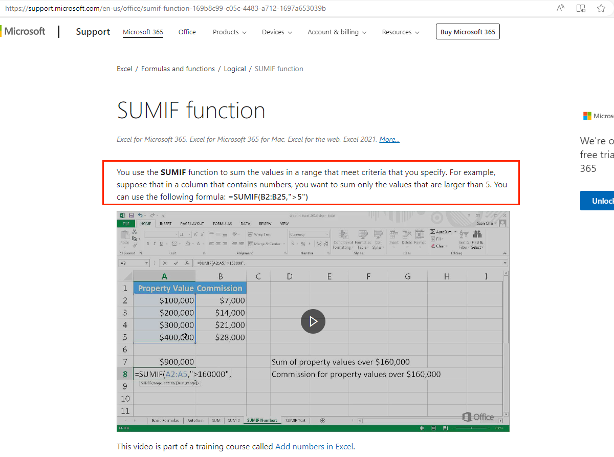
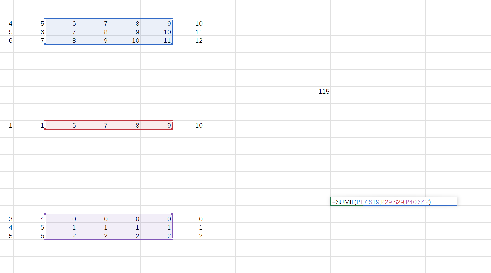
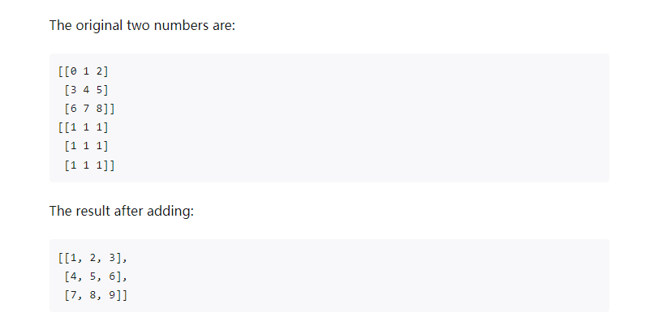

# @univerjs/sheets-formula

[](https://npmjs.org/package/@univerjs/sheets-formula)
[](https://img.shields.io/npm/l/@univerjs/sheets-formula)


## Introduction

`@univerjs/sheets-formula` provides the ability to edit formulas in spreadsheets, including features such as auto-completion, formula suggestions, drop-down filling for formulas, and copy-paste functionality.

:::note
Formula calculation is one of the core functionalities of spreadsheets, and formula calculation scheduling is done in `@univerjs/sheets`.
:::

## Usage

### Installation

```shell
# Using npm
npm install @univerjs/sheets-formula

# Using pnpm
pnpm add @univerjs/sheets-formula
```

### Add formula preconditions

If the officially provided formula does not meet your needs, you can expand the formula yourself. Depending on different needs, we provide multiple ways to support registering one or more custom formulas.

You need to first prepare the international copywriting and algorithms required for formula prompts, and then refer to our [Contribution Guide](https://github.com/dream-num/univer/blob/dev/CONTRIBUTING.md) to run the Univer project , and then start adding formulas.

### How to add formulas using Uniscript

Using Uniscript scripts, you can quickly and easily register custom formulas in the current Univer instance.

As shown in the following case, use `registerFunction` to register the algorithm, name, and description required by a `CUSTOMSUM` formula into the formula plug-in at one time. After execution, the formula can be used. Enter `=CUSTOMSUM` in any blank cell to see the prompt.

```js
univerAPI.registerFunction({
    calculate: [
        [function (...variants) {
            let sum = 0;

            for(const variant of variants){
                sum += Number(variant) || 0;
            }

            return sum;
        }, 'CUSTOMSUM', 'Adds its arguments'],
        // ... more formulas
    ]
})
```

Use the `unregisterFunction` method to quickly unregister custom formulas

```ts
univerAPI.unregisterFunction({
     functionNames: ['CUSTOMSUM']
})
```

If you want to provide more complete international content and description, you can also configure the `locales` and `description` fields. As follows.

```js
const FUNCTION_NAMES_USER = {
     CUSTOMSUM: 'CUSTOMSUM'
}
univerAPI.registerFunction({
    locales:{
        'zhCN': {
            formulaCustom: {
                CUSTOMSUM: {
                description: '将单个值、单元格引用或是区域相加，或者将三者的组合相加。',
                abstract: '求参数的和',
                links: [
                    {
                        title: '教学',
                        url: 'https://support.microsoft.com/zh-cn/office/sum-%E5%87%BD%E6%95%B0-043e1c7d-7726-4e80-8f32-07b23e057f89',
                    },
                ],
                functionParameter: {
                    number1: {
                        name: '数值1',
                        detail: '要相加的第一个数字。 该数字可以是 4 之类的数字，B6 之类的单元格引用或 B2:B8 之类的单元格范围。',
                    },
                    number2: {
                        name: '数值2',
                        detail: '这是要相加的第二个数字。 可以按照这种方式最多指定 255 个数字。',
                    },
                },
            },
                // ... more formulas
            },
        },
        'enUS':{
            formulaCustom:{
                CUSTOMSUM: {
                    description: `You can add individual values, cell references or ranges or a mix of all three.`,
                    abstract: `Adds its arguments`,
                    links: [
                        {
                            title: 'Instruction',
                            url: 'https://support.microsoft.com/en-us/office/sum-function-043e1c7d-7726-4e80-8f32-07b23e057f89',
                        },
                    ],
                    functionParameter: {
                        number1: {
                            name: 'number1',
                            detail: 'The first number you want to add. The number can be like 4, a cell reference like B6, or a cell range like B2:B8.',
                        },
                        number2: {
                            name: 'number2',
                            detail: 'This is the second number you want to add. You can specify up to 255 numbers in this way.',
                        },
                    },
                },
            }
        }
    },
    description:[
        {
            functionName: FUNCTION_NAMES_USER.CUSTOMSUM,
            aliasFunctionName: 'formulaCustom.CUSTOMSUM.aliasFunctionName',
            functionType: 15,
            description: 'formulaCustom.CUSTOMSUM.description',
            abstract: 'formulaCustom.CUSTOMSUM.abstract',
            functionParameter: [
                {
                    name: 'formulaCustom.CUSTOMSUM.functionParameter.number1.name',
                    detail: 'formulaCustom.CUSTOMSUM.functionParameter.number1.detail',
                    example: 'A1:A20',
                    require: 1,
                    repeat: 0,
                },
                {
                    name: 'formulaCustom.CUSTOMSUM.functionParameter.number2.name',
                    detail: 'formulaCustom.CUSTOMSUM.functionParameter.number2.detail',
                    example: 'B2:B10',
                    require: 0,
                    repeat: 1,
                },
            ],
        },
        // ... more formulas
    ],
    calculate: [
        [function (...variants) {
            let sum = 0;

            for(const variant of variants){
                sum += Number(variant) || 0;
            }

            return sum;
        }, FUNCTION_NAMES_USER.CUSTOMSUM],
        // ... more formulas
    ]
})
```

Note

-   Multiple languages can be set under `locales`. For naming rules, please refer to [LocaleType](/api/core/enums/LocaleType.html). Translations for multiple formulas can be added under `functionList`. For detailed field descriptions, please refer to the [How to add formulas in UniverFormulaEnginePlugin](./#how-to-add-formulas-in-univerformulaengineplugin) section.
-   `description` sets the description of the custom formula.
-   `calculate` writes the specific algorithm and name mapping of the calculation formula. The input parameter is the content entered by the user when using the formula, which may be a number, a string, a Boolean value, or a range, and the same format is returned.

Likewise, if using the `unregisterFunction` method, it is recommended that you remove the internationalization files as well. The example below removes the Chinese and English `formulaCustom` nodes.

```ts
univerAPI.unregisterFunction({
    localeKeys: {
        'zhCN': ['formulaCustom'],
        'enUS': ['formulaCustom'],
        },
    functionNames: ['CUSTOMSUM']
})
```

Uniscript uses `@univerjs/facade` under the hood. You can also use Uniscript-like APIs directly in your project. Please refer to [Registering Function](/en-us/guides/facade/register-function).

### How to add formulas when initializing Univer

Follow the steps below to implement a custom formula `CUSTOMSUM`.

You can create a new `custom-function.ts` file to specifically place custom formula-related modules, or write it directly before `univer` is initialized.

1. Define formula name

    First, give the formula a name. We require that it cannot be repeated with the name of the existing formula. The existing formula is mainly from [Office Excel](https://support.microsoft.com/en-us/office/excel-functions-by-category-5f91f4e9-7b42-46d2-9bd1-63f26a86c0eb) refer to.

    We collect multiple custom formulas in an enumeration.

    ```ts
    /**
     * function name
     */
    export enum FUNCTION_NAMES_USER {
      CUSTOMSUM = "CUSTOMSUM",
    }
    ```

2. Define internationalization

    Define the international content you need. For detailed field descriptions, please refer to the [How to add formulas in UniverFormulaEnginePlugin](./#how-to-add-formulas-in-univerformulaengineplugin) section. Similarly, multiple formulas are distinguished by using the formula name as the `key` value.

    ```ts
    /**
     *i18n
     */
    export const functionEnUS = {
        formulaCustom: {
            CUSTOMSUM: {
                description: `You can add individual values, cell references or ranges or a mix of all three.`,
                abstract: `Adds its arguments`,
                links: [
                    {
                        title: 'Instruction',
                        url: 'https://support.microsoft.com/en-us/office/sum-function-043e1c7d-7726-4e80-8f32-07b23e057f89',
                    },
                ],
                functionParameter: {
                    number1: {
                        name: 'number1',
                        detail: 'The first number you want to add. The number can be like 4, a cell reference like B6, or a cell range like B2:B8.',
                    },
                    number2: {
                        name: 'number2',
                        detail: 'This is the second number you want to add. You can specify up to 255 numbers in this way.',
                    },
                },
            },
        },
    };

    export const functionZhCN = {
        formulaCustom: {
            CUSTOMSUM: {
                description: '将单个值、单元格引用或是区域相加，或者将三者的组合相加。',
                abstract: '求参数的和',
                links: [
                    {
                        title: '教学',
                        url: 'https://support.microsoft.com/zh-cn/office/sum-%E5%87%BD%E6%95%B0-043e1c7d-7726-4e80-8f32-07b23e057f89',
                    },
                ],
                functionParameter: {
                    number1: {
                        name: '数值1',
                        detail: '要相加的第一个数字。 该数字可以是 4 之类的数字，B6 之类的单元格引用或 B2:B8 之类的单元格范围。',
                    },
                    number2: {
                        name: '数值2',
                        detail: '这是要相加的第二个数字。 可以按照这种方式最多指定 255 个数字。',
                    },
                },
            },
        },
    };
    ```

3. Registration internationalization

    Expand the internationalization content you defined in the original internationalization object.

    ```ts
    export const locales = {
        [LocaleType.EN_US]: {
            ...UniverSheetsEnUS,
            ...UniverDocsUIEnUS,
            ...UniverSheetsUIEnUS,
            ...UniverUiEnUS,
            ...UniverDesignEnUS,
            ...functionEnUS,
        },
        [LocaleType.ZH_CN]: {
            ...functionZhCN,
        },
    };
    ```

4. Definition description

    The description of the formula mainly configures internationalized fields, which are used for formula search prompts, details panels, etc.

    ```ts
    import type { IFunctionInfo } from '@univerjs/engine-formula';
    import { FunctionType } from '@univerjs/engine-formula';

    /**
    * description
    */
    export const FUNCTION_LIST_USER: IFunctionInfo[] = [
        {
            functionName: FUNCTION_NAMES_USER.CUSTOMSUM,
            aliasFunctionName: 'formulaCustom.CUSTOMSUM.aliasFunctionName',
            functionType: FunctionType.User,
            description: 'formulaCustom.CUSTOMSUM.description',
            abstract: 'formulaCustom.CUSTOMSUM.abstract',
            functionParameter: [
                {
                    name: 'formulaCustom.CUSTOMSUM.functionParameter.number1.name',
                    detail: 'formulaCustom.CUSTOMSUM.functionParameter.number1.detail',
                    example: 'A1:A20',
                    require: 1,
                    repeat: 0,
                },
                {
                    name: 'formulaCustom.CUSTOMSUM.functionParameter.number2.name',
                    detail: 'formulaCustom.CUSTOMSUM.functionParameter.number2.detail',
                    example: 'B2:B10',
                    require: 0,
                    repeat: 1,
                },
            ],
        },
    ];
    ```

5. Registration description

    Pass in the description object you defined when registering the formula plug-in.

    ```ts
    // universal
    univer.registerPlugin(UniverSheetsFormulaPlugin, {
        description: FUNCTION_LIST_USER,
    });
    ```

6. Define formula algorithm

    Write specific formula calculation logic, map algorithms and formula names.

    ```ts
    import type { ArrayValueObject, BaseValueObject, IFunctionInfo } from '@univerjs/engine-formula';
    import { BaseFunction, FunctionType, NumberValueObject } from '@univerjs/engine-formula';

    /**
    * Function algorithm
    */
    export class Customsum extends BaseFunction {
        override calculate(...variants: BaseValueObject[]) {
            let accumulatorAll: BaseValueObject = NumberValueObject.create(0);
            for (let i = 0; i < variants.length; i++) {
                let variant = variants[i];

                if (variant.isError()) {
                return variant;
                }

                if (accumulatorAll.isError()) {
                return accumulatorAll;
                }

                if (variant.isArray()) {
                variant = (variant as ArrayValueObject).sum();
                }

                accumulatorAll = accumulatorAll.plus(variant as BaseValueObject);
            }

            return accumulatorAll;
        }
    }

    // Mapping of algorithms and names
    export const functionUser = [[Customsum, FUNCTION_NAMES_USER.CUSTOMSUM]];
    ```

7. Registration formula algorithm

    Pass in the formula algorithm object you defined in `UniverFormulaEnginePlugin`.

    ```ts
    univer.registerPlugin(UniverFormulaEnginePlugin, {
        function: functionUser,
    });
    ```

    Please note: If `UniverFormulaEnginePlugin` is instantiated in `worker`, you need to register the formula algorithm in `UniverFormulaEnginePlugin` in `worker`, otherwise the custom formula cannot be executed.

8. Test

    At this point, the development of the custom formula is completed, and now it is time to test it. Enter `=CUSTOMSUM` in any blank cell and expect to get a formula prompt. Here is a [Custom Formula Demo](/playground?title=Custom%20Function) for reference.

### How to add formulas in third-party plug-ins

If you are developing a Univer plug-in, you can add custom formulas directly to the plug-in to facilitate code management in a plug-in repository.

Our internal `UniverFormulaEnginePlugin` plug-in provides a `function.service` specifically for registering formula descriptions and algorithms.

First refer to [Custom Plugin](https://univer.ai/guides/customization/write-a-plugin/) to create a new plug-in, and then you can start adding custom formulas.

1. Create a new `custom-function.ts` file in the `common` file and write all the basic modules required for the formula.

    ```ts
    import type { ArrayValueObject, BaseValueObject, IFunctionInfo } from '@univerjs/engine-formula';
    import { BaseFunction, FunctionType, NumberValueObject } from '@univerjs/engine-formula';

    /**
     * function name
     */
    export enum FUNCTION_NAMES_USER {
        CUSTOMSUM = 'CUSTOMSUM',
    }

    /**
     *i18n
     */
    export const functionEnUS = {
        formulaCustom: {
            CUSTOMSUM: {
                description: `You can add individual values, cell references or ranges or a mix of all three.`,
                abstract: `Adds its arguments`,
                links: [
                    {
                        title: 'Instruction',
                        url: 'https://support.microsoft.com/en-us/office/sum-function-043e1c7d-7726-4e80-8f32-07b23e057f89',
                    },
                ],
                functionParameter: {
                    number1: {
                        name: 'number1',
                        detail: 'The first number you want to add. The number can be like 4, a cell reference like B6, or a cell range like B2:B8.',
                    },
                    number2: {
                        name: 'number2',
                        detail: 'This is the second number you want to add. You can specify up to 255 numbers in this way.',
                    },
                },
            },
        },
    };

    export const functionZhCN = {
        formulaCustom: {
            CUSTOMSUM: {
                description: '将单个值、单元格引用或是区域相加，或者将三者的组合相加。',
                abstract: '求参数的和',
                links: [
                    {
                        title: '教学',
                        url: 'https://support.microsoft.com/zh-cn/office/sum-%E5%87%BD%E6%95%B0-043e1c7d-7726-4e80-8f32-07b23e057f89',
                    },
                ],
                functionParameter: {
                    number1: {
                        name: '数值1',
                        detail: '要相加的第一个数字。 该数字可以是 4 之类的数字，B6 之类的单元格引用或 B2:B8 之类的单元格范围。',
                    },
                    number2: {
                        name: '数值2',
                        detail: '这是要相加的第二个数字。 可以按照这种方式最多指定 255 个数字。',
                    },
                },
            },
        },
    };

    /**
     * description
     */
    export const FUNCTION_LIST_USER: IFunctionInfo[] = [
        {
            functionName: FUNCTION_NAMES_USER.CUSTOMSUM,
            aliasFunctionName: 'formulaCustom.CUSTOMSUM.aliasFunctionName',
            functionType: FunctionType.User,
            description: 'formulaCustom.CUSTOMSUM.description',
            abstract: 'formulaCustom.CUSTOMSUM.abstract',
            functionParameter: [
                {
                    name: 'formulaCustom.CUSTOMSUM.functionParameter.number1.name',
                    detail: 'formulaCustom.CUSTOMSUM.functionParameter.number1.detail',
                    example: 'A1:A20',
                    require: 1,
                    repeat: 0,
                },
                {
                    name: 'formulaCustom.CUSTOMSUM.functionParameter.number2.name',
                    detail: 'formulaCustom.CUSTOMSUM.functionParameter.number2.detail',
                    example: 'B2:B10',
                    require: 0,
                    repeat: 1,
                },
            ],
        },
    ];

    /**
     * Function algorithm
     */
    export class Customsum extends BaseFunction {
        override calculate(...variants: BaseValueObject[]) {
            let accumulatorAll: BaseValueObject = NumberValueObject.create(0);
            for (let i = 0; i < variants.length; i++) {
                let variant = variants[i];

                if (variant.isError()) {
                    return variant;
                }

                if (accumulatorAll.isError()) {
                    return accumulatorAll;
                }

                if (variant.isArray()) {
                    variant = (variant as ArrayValueObject).sum();
                }

                accumulatorAll = accumulatorAll.plus(variant as BaseValueObject);
            }

            return accumulatorAll;
        }
    }

    export const functionUser = [[Customsum, FUNCTION_NAMES_USER.CUSTOMSUM]];
    ```

2. Create a new `custom-description.controller.ts` under the `controllers` folder to register formula internationalization content and description.

    ```ts
    import { Disposable, LifecycleStages, LocaleService, OnLifecycle } from '@univerjs/core';
    import { Inject } from '@wendellhu/redi';

    import { FUNCTION_LIST_USER, functionEnUS, functionZhCN } from '../common/custom-function';
    import { IDescriptionService } from '../services/description.service';

    @OnLifecycle(LifecycleStages.Ready, CustomDescriptionController)
    export class CustomDescriptionController extends Disposable {
        constructor(
            @IDescriptionService private readonly _descriptionService: IDescriptionService,
            @Inject(LocaleService) private readonly _localeService: LocaleService
        ) {
            super();

            this._initialize();
        }

        private _initialize(): void {
            this._registerLocales();
            this._registerCustomDescriptions();
        }

        private _registerLocales() {
            this._localeService.load({
                zhCN: functionZhCN,
                enUS: functionEnUS,
            });
        }

        private _registerCustomDescriptions() {
            this._descriptionService.registerDescription(FUNCTION_LIST_USER);
        }
    }
    ```

3. Create a new `custom-function.controller.ts` under the `controllers` folder to register formula algorithms.

    ```ts
    import { Disposable, LifecycleStages, OnLifecycle } from '@univerjs/core';
    import type { BaseFunction, IFunctionNames } from '@univerjs/engine-formula';
    import { IFunctionService } from '@univerjs/engine-formula';
    import { type Ctor } from '@wendellhu/redi';

    import { functionUser } from '../common/custom-function';

    @OnLifecycle(LifecycleStages.Ready, CustomFunctionController)
    export class CustomFunctionController extends Disposable {
        constructor(@IFunctionService private readonly _functionService: IFunctionService) {
            super();

            this._initialize();
        }

        private _initialize(): void {
            this._registerCustomFunctions();
        }

        private _registerCustomFunctions() {
            const functions: BaseFunction[] = [...functionUser].map((registerObject) => {
                const Func = registerObject[0] as Ctor<BaseFunction>;
                const name = registerObject[1] as IFunctionNames;

                return new Func(name);
            });

            this._functionService.registerExecutors(...functions);
        }
    }
    ```

4. In the plug-in entry file `plugin.ts`, register `custom-description.controller.ts` and `custom-function.controller.ts` into the DI system.

    ```ts
    initialize(): void {
        // ... other logic

        const dependencies: Dependency[] = [
             // ... other modules
            [CustomFunctionController],
            [CustomDescriptionController],
        ];

        dependencies.forEach((dependency) => this._injector.add(dependency));
    }
    ```

    Start Univer and enter `=CUSTOMSUM` in any blank cell to test this newly added formula.

Please note: If `UniverFormulaEnginePlugin` is instantiated in `worker`, you need to register the formula algorithm in `worker`, otherwise the custom formula cannot be executed.
In addition to registering through the `UniverFormulaEnginePlugin` configuration, the formula algorithm module can also be separately packaged as a plug-in for registration.

First of all, there is no need to register `CustomFunctionController` in `plugin.ts`. Create a new `custom-function-plugin.ts` in the same directory, specifically for registering `CustomFunctionController`.

```ts
import { Plugin, PluginType } from '@univerjs/core';
import type { Dependency } from '@wendellhu/redi';
import { Inject, Injector } from '@wendellhu/redi';

import { FORMULA_UI_PLUGIN_NAME } from './common/plugin-name';
import { CustomFunctionController } from './controllers/custom-function.controller';

export class UniverSheetsCustomFunctionPlugin extends Plugin {
     static override type = PluginType.Sheet;

     constructor(@Inject(Injector) override readonly _injector: Injector) {
         super(FORMULA_UI_PLUGIN_NAME);
     }

     initialize(): void {
         const dependencies: Dependency[] = [[CustomFunctionController]];

         dependencies.forEach((dependency) => this._injector.add(dependency));
     }

     override onReady(): void {
         this.initialize();
     }
}
```

Then export it in `index.ts`

```ts
export { UniverSheetsFormulaPlugin } from './formula-ui-plugin';
```

Finally, your `worker` entry initializes the plugin.

```ts
import { UniverSheetsCustomFunctionPlugin } from '@univerjs/sheets-formula';

// ...initialize other plugins
univer.registerPlugin(UniverSheetsCustomFunctionPlugin);
```

This way you can register the formula in `worker`.

### How to add formulas in UniverFormulaEnginePlugin

#### Reference Documentation

[Office Excel functions (by category)](https://support.microsoft.com/en-us/office/excel-functions-by-category-5f91f4e9-7b42-46d2-9bd1-63f26a86c0eb)

#### Categories

Detailed API reference [FunctionType](/api/engine-formula/enums/FunctionType.html)

-   Financial
-   Date
-   Math
-   Statistical
-   Lookup
-   Database
-   Text
-   Logical
-   Information
-   Engineering
-   Cube
-   Compatibility
-   Web
-   Array
-   Univer
-   User

#### Requirements

To implement a formula, you need to add formula description, internationalization, and formula algorithm. Take the `SUMIF` function as an example for reference.

1. Add Function Name

    Location: [packages/engine-formula/src/functions/math/function-names.ts](https://github.com/dream-num/univer/blob/dev/packages/engine-formula/src/functions/math/function-names.ts).

    Each category has a folder containing a `function-names` file to manage all function names in that category. Add the function name, which will be used in the `sheets-formula` plugin.

    Note that a function in Excel may belong to multiple categories. For example, `FLOOR` appears in Compatibility and Math Functions, and we classify it under the Math category. Other functions are treated similarly, based on the exact classification.

    > Most Excel functions have already written function names. New functions can be added at the end

2. Internationalization Files

    Location: [packages/sheets-formula/src/locale/function-list/math/en-US.ts](https://github.com/dream-num/univer/blob/dev/packages/sheets-formula/src/locale/function-list/math/en-US.ts).

    Internationalization is organized by category, with a file for each category. Refer to the Office function category page for a brief overview.
    

    Refer to the Office function details page for function descriptions and parameter descriptions.
    

    Most function names already have basic description, abstract, links, and parameter structures. It is recommended to modify them based on this foundation. If a function is not present, add it to the end.

    Requirements:

    - Use the English names of function parameters as the `key` for translation, e.g., `SUMIF`. Generally, do not modify unless there is an error.
    - Extract the `description` from the content, as some Excel descriptions are lengthy and need simplification.
    - `abstract` and `links` generally do not need modification.
    - `aliasFunctionName` is optional; most formulas do not need to be filled (or can be set for aliases in specific countries). Currently, there is no documentation for formula aliases. Currently I have found a function translation plug-in that may provide similar functions [Excel Functions Translator](https://support.microsoft.com/en-us/office/excel-functions-translator-f262d0c0-991c-485b-89b6-32cc8d326889)
    - `functionParameter` needs a name for each parameter. We recommend varying names based on the parameter's meaning, e.g., use `number` for a numeric parameter (if there is only one) or `number1`, `number2` for multiple numeric parameters. Use `range` for a range, `criteria` for conditions, and `sum_range` for the sum range (separated by `_` for multiple words).
    - Some Chinese translations in the Office function documentation are machine-translated and may be unclear. Modify as needed. For example, `单元格参考` (Cell Reference) should be translated as `单元格引用`. Numeric type parameters are uniformly translated as: `数值`.
    - Do not end `abstract` with a period (used in the search list when users input cells), but end `description` and `detail` with a period (used in descriptions).
    - Capitalize the first letter of English sentences.
    - Ensure that all existing internationalization files are filled. Currently, there are only Chinese, English, and Japanese translations (languages can be switched at the bottom of the Excel introduction page).

3. Formula Descriptions

    `SUMIF` belongs to the `math` category, and the description is in [packages/sheets-formula/src/services/function-list/math.ts](https://github.com/dream-num/univer/blob/dev/packages/sheets-formula/src/services/function-list/math.ts), which manages all functions in the `math` category.

    Most function names already have basic description structure. It is recommended to modify them based on this foundation. If a function is not present, add it to the end.

    Requirements:

    - Add the formula to the `FUNCTION_LIST_MATH` array. It is recommended to keep the order consistent with the internationalization file for easy management and retrieval.
    - Reference the previously defined `FUNCTION_NAMES_MATH` enum for the `functionName`.
    - `aliasFunctionName` is also optional; if there are no aliases in the internationalization file, you do not need to add them here.
    - Pay attention to the correspondence between internationalization fields and function and parameter names.
    - Modify function parameter information, including the `example` parameter example (e.g., for a range, use `"A1:A20"`; for conditions, use `">5"`), the `require` parameter (1 for required, 0 for optional), and the `repeat` parameter (1 for allowed, 0 for not allowed). For detailed information, refer to the interface [IFunctionParam](https://github.com/dream-num/univer/blob/dev/packages/engine-formula/src/basics/function.ts).

4. Formula Algorithm

    Location: [packages/engine-formula/src/functions/math/sumif/index.ts](https://github.com/dream-num/univer/blob/dev/packages/engine-formula/src/functions/math/sumif/index.ts).

    Create a new folder for the formula under the current formula category, with one folder per formula. Then create an `index.ts` file to write the formula algorithm. Use camel case for the formula `class` name, considering the formula as one word. If a formula contains `_` or `.`, treat it as two words, such as:

    - `SUMIF` => `Sumif`
    - `NETWORKDAYS.INTL` => `Networkdays_Intl`
    - `ARRAY_CONSTRAIN` => `Array_Constrain`

    Create a `__tests__` folder at the same level to write unit tests. After writing, remember to add the formula algorithm and function name mapping in the `function-map` file in the category directory to register the formula algorithm.

    Location: [packages/engine-formula/src/functions/math/function-map.ts](https://github.com/dream-num/univer/blob/dev/packages/engine-formula/src/functions/math/function-map.ts).

5. Unit Tests

    Location: [packages/engine-formula/src/functions/math/sumif/\_\_tests\_\_/index.spec.ts](https://github.com/dream-num/univer/blob/dev/packages/engine-formula/src/functions/math/sumif/__tests__/index.spec.ts)

    Note:

    - Supplement `sheetData` according to the formula's calculation needs, construct `cellData` based on the calculated data, and determine `rowCount` and `columnCount`.
    - Manually initialize the formula with `new Sumif(FUNCTION_NAMES_MATH.SUMIF)`.
    - Manually build the formula parameters for each test, and execute `calculate` at the end.
    - Single formula tests are generally used for testing the algorithm of the current formula. If testing nested formulas with multiple formulas is needed, manually nest them or go to the `/packages/engine-formula/src/functions/__tests__` directory to execute complex nested formulas.

6. Functional Tests

    Start Univer in development mode, test formulas on the interface, and preconstruct data.

    - In any blank cell, enter `=sumif`. Expect a search prompt list to appear.
    - After selecting `SUMIF` or entering `=sumif(`, trigger the formula details popup and carefully check the contents.
    - Select the data range, trigger the calculation, and check if the formula calculation result is correct.

#### Considerations for Formula Implementation

-   Any formula's input and output can be `A1`, `A1:B10`, etc. When researching Excel, consider all cases, such as `=SIN(A1:B10)`, which expands to the calculated range.
    -   For example, the `XLOOKUP` function requires at least one of the rows or columns of its two inputs to be of equal size for matrix calculation.
    -   For example, the `SUMIF` function, although commonly used for summation, can expand based on the second parameter.
        
        
    -   Excel formula calculation is becoming more like numpy, for example:
        
-   For numerical calculations in formulas, use built-in methods and try to avoid obtaining values for manual calculation. Because formula parameters can be values, arrays, or references. You can refer to existing `sum` and `minus` functions.
-   Precision issues: The formula introduces `big.js`, and using built-in methods will call this library. However, it is nearly 100 times slower than native calculations. Therefore, for methods like `sin`, it is advisable to use native implementations.
-   For custom calculations, use the `product` function, suitable for calculating two input parameters. Call `map` to iterate over the values for changes to a parameter's own values.

#### Formula Basic Tools

1. `ValueObjectFactory` is used to automatically recognize parameter formats and create a parameter instance. Use `RangeReferenceObject` to create parameter instances for range-type data.
2. The array `toArrayValueObject` can be operated directly with values to get a new array.
