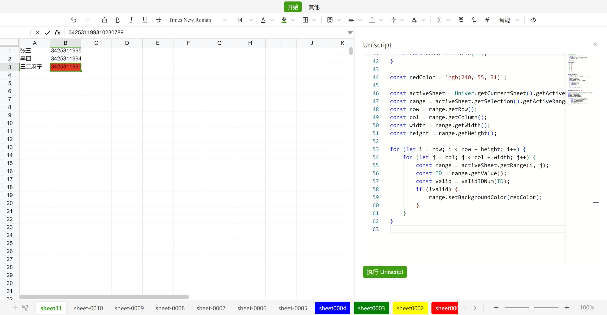

# @univerjs/uniscript

## Package Overview

| Package Name | UMD Namespace | Version | License | Downloads | Contains CSS | Contains i18n locales |
| --- | --- | --- | --- | --- | :---: | :---: |
| `@univerjs/uniscript` | `UniveUniscript` | [![][npm-version-shield]][npm-version-link] | ![][npm-license-shield] | ![][npm-downloads-shield] | ⭕️ | ⭕️ |

## Introduction



`@univerjs/uniscript` uses the DSL (Domain-Specific Language) provided by `@univerjs/facade` and creates a code editor for Users to write code for operating Univer's data structures and business logic.

Users can write business logic in the code editor to meet more flexible business requirements. For instance, as shown in the illustration, users can write a Uniscript to read identity card numbers from a selected area and validate their legality, and mark the background of invalid identity card numbers with red.

> [!CAUTION]
> The Uniscript is currently in the experimental stage, and it is not recommended to use it in production environments. You can refer to the [Roadmap](https://univer.ai/guides/sheet/roadmap) to understand the iteration plan of Uniscript.

> [!TIP]
> Indeed, Uniscript's Domain-Specific Language (DSL) is a set of Facade APIs that encapsulate the internal implementation details of Univer. This API is defined [here](https://univer.ai/guides/sheet/facade/facade).

## Usage

### Installation

```shell
# Using npm
npm install @univerjs/uniscript

# Using pnpm
pnpm add @univerjs/uniscript
```

### Get the Editor Instance

The `@univerjs/uniscript` uses [Monaco Editor](https://microsoft.github.io/monaco-editor/) as its code editor. You can obtain an instance of the editor through the following method:

```ts
const editor = univer.__getInjector().get(ScriptEditorService).getEditorInstance();
```

Or inject `ScriptEditorService` into your module to obtain the editor instance.

```ts
export class YourModule {
  constructor(
    @Inject(ScriptEditorService) private readonly _scriptEditorService
  ) {}

  private _getEditor() {
    return this._scriptEditorService.getEditorInstance();
  }
}
```

<!-- Links -->
[npm-version-shield]: https://img.shields.io/npm/v/@univerjs/uniscript?style=flat-square
[npm-version-link]: https://npmjs.com/package/@univerjs/uniscript
[npm-license-shield]: https://img.shields.io/npm/l/@univerjs/uniscript?style=flat-square
[npm-downloads-shield]: https://img.shields.io/npm/dm/@univerjs/uniscript?style=flat-square
